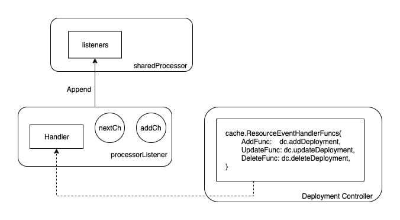

文档内容仅作为学习笔记，部分内容来源互联网，[参考文献](#参考文献)已做来源说明，若侵权请联系私信删除。

# kube-controller-manager

## 简介

> 什么是`kube-controller-manager`？

`Controller Manager`是`Kubernetes`的核心组件之一。
`Kubernetes`对集群的管理采用的是控制器模式，即针对各种资源运行多个`controller`（控制器）。
控制器的逻辑是运行永不结束的循环，通过`apiserver`组件时刻获取集群某种资源的状态，并确保资源的当前状态与期望的状态相符合。

简单来讲，`kube-controller-manager`是`k8s`的控制中心，
通过不同的子资源控制器（`namespace controller`、`Deployment controller`）来控制对应资源（比如：`namespace、Deployment`等）的期望状态

例如：通过`Deployment`创建`pod`发生异常退出时，`Rs Controller`便会接受并处理该退出事件，创建新的`pod`来维持预期副本数

几乎每种特定资源都有特定的`Controller`维护管理以保持预期状态，
而`Controller Manager`的职责便是把所有的`Controller`聚合起来：
- 提供基础设施降低`Controller`的实现复杂度(`api-server`连接客户端)
- 启动和维持`Controller`的正常运行

## 工作流程分析

从功能角度来看, `Controller Manager`主要提供了一个分发事件的能力，
而不同的`Controller`只需要注册对应的`Handler`来等待接收和处理事件。


以`Deployment Controller`为例，[NewDeploymentController()](../../pkg/controller/deployment/deployment_controller.go) 方法
中便包括了`Event Handler`的注册，对于`Deployment Controller`来说，只需要根据不同的事件实现不同的处理逻辑，便可以实现对相应资源的管理

其中注册的事件监听，包含：
- `Deployment`新增、更新、删除事件
- `Replicas Controller`新增、更新、删除事件
- `Pod`删除事件

```
// NewDeploymentController creates a new DeploymentController.
func NewDeploymentController(dInformer appsinformers.DeploymentInformer, rsInformer appsinformers.ReplicaSetInformer, podInformer coreinformers.PodInformer, client clientset.Interface) (*DeploymentController, error) {
	eventBroadcaster := record.NewBroadcaster()
	eventBroadcaster.StartLogging(klog.Infof)
	eventBroadcaster.StartRecordingToSink(&v1core.EventSinkImpl{Interface: client.CoreV1().Events("")})

	if client != nil && client.CoreV1().RESTClient().GetRateLimiter() != nil {
		if err := ratelimiter.RegisterMetricAndTrackRateLimiterUsage("deployment_controller", client.CoreV1().RESTClient().GetRateLimiter()); err != nil {
			return nil, err
		}
	}
	dc := &DeploymentController{
		client:        client,
		eventRecorder: eventBroadcaster.NewRecorder(scheme.Scheme, v1.EventSource{Component: "deployment-controller"}),
		queue:         workqueue.NewNamedRateLimitingQueue(workqueue.DefaultControllerRateLimiter(), "deployment"),
	}
	dc.rsControl = controller.RealRSControl{
		KubeClient: client,
		Recorder:   dc.eventRecorder,
	}

    // Deployment新增、更新、删除事件
	dInformer.Informer().AddEventHandler(cache.ResourceEventHandlerFuncs{
		AddFunc:    dc.addDeployment,
		UpdateFunc: dc.updateDeployment,
		// This will enter the sync loop and no-op, because the deployment has been deleted from the store.
		DeleteFunc: dc.deleteDeployment,
	})

    // Replicas Controller新增、更新、删除事件
	rsInformer.Informer().AddEventHandler(cache.ResourceEventHandlerFuncs{
		AddFunc:    dc.addReplicaSet,
		UpdateFunc: dc.updateReplicaSet,
		DeleteFunc: dc.deleteReplicaSet,
	})

    // Pod删除事件
	podInformer.Informer().AddEventHandler(cache.ResourceEventHandlerFuncs{
		DeleteFunc: dc.deletePod,
	})

	dc.syncHandler = dc.syncDeployment
	dc.enqueueDeployment = dc.enqueue

	dc.dLister = dInformer.Lister()
	dc.rsLister = rsInformer.Lister()
	dc.podLister = podInformer.Lister()
	dc.dListerSynced = dInformer.Informer().HasSynced
	dc.rsListerSynced = rsInformer.Informer().HasSynced
	dc.podListerSynced = podInformer.Informer().HasSynced
	return dc, nil
}
```

可以看到，在`Controller Manager`的帮助下，`Controller`的逻辑可以做的非常纯粹，
只需要实现相应的`EventHandler`即可，那么`Controller Manager`都做了哪些具体的工作呢？

## 架构分析

辅助`Controller Manager`完成事件分发的是`client-go`，而其中比较关键的模块便是`informer`。

从`client-go`的架构图中可以看出，`Controller`正是下半部分（`CustomController`）描述的内容，
而`Controller Manager`主要完成的是上半部分。


> `Informer`工厂

从上图可以看到`Informer`是一个非常关键的`桥梁`作用，
因此对`Informer`的管理便是`Controller Manager`要做的第一件事

在`Controller Manager`启动时，便会创建一个名为`SharedInformerFactory`的单例工厂，
因为每个`Informer`都会与`Api Server`维持一个`watch`长连接，所以这个单例工厂通过为所有`Controller`提供了唯一获取`Informer`的入口，来保证每种类型的`Informer`只被实例化一次。

```shell script
func NewSharedInformerFactoryWithOptions(client kubernetes.Interface, defaultResync time.Duration, options ...SharedInformerOption) SharedInformerFactory {
	factory := &sharedInformerFactory{
		client:           client,
		namespace:        v1.NamespaceAll,
		defaultResync:    defaultResync,
		informers:        make(map[reflect.Type]cache.SharedIndexInformer),
		startedInformers: make(map[reflect.Type]bool),
		customResync:     make(map[reflect.Type]time.Duration),
	}

	// Apply all options
	for _, opt := range options {
		factory = opt(factory)
	}

	return factory
}
```

从上面的初始化逻辑中可以看到，`sharedInformerFactory`中最重要的是名为`informers`的`map`，
其中`key`为资源类型(如`namespace`)，而`value`便是监控该资源类型的`Informer`。
每种类型的`Informer`只会被实例化一次，并存储在`map`中，不同`Controller`需要相同资源的`Informer`时只会拿到同一个`Informer`实例。

对于`Controller Manager`来说，维护所有的`Informer`使其正常工作，是保证所有`Controller`正常工作的基础条件。
`sharedInformerFactory`通过该`map`维护了所有的`informer`实例，
因此`sharedInformerFactory`也承担了提供统一启动入口的职责：

- [factory.go](../../staging/src/k8s.io/client-go/informers/factory.go) 

```shell script
// Start initializes all requested informers.
func (f *sharedInformerFactory) Start(stopCh <-chan struct{}) {
	f.lock.Lock()
	defer f.lock.Unlock()

	for informerType, informer := range f.informers {
		if !f.startedInformers[informerType] {
			go informer.Run(stopCh)
			f.startedInformers[informerType] = true
		}
	}
}
```

当`Controller Manager`启动时，最重要的就是通过该工厂的`Start`方法，将所有的`Informer`运行起来。

> `Informer`创建流程

以`Deployment Controller`为例，分析`Informer`创建流程

[startDeploymentController()函数](../../cmd/kube-controller-manager/app/apps.go)

```shell script
func startDeploymentController(ctx ControllerContext) (http.Handler, bool, error) {
	if !ctx.AvailableResources[schema.GroupVersionResource{Group: "apps", Version: "v1", Resource: "deployments"}] {
		return nil, false, nil
	}
	dc, err := deployment.NewDeploymentController(
		ctx.InformerFactory.Apps().V1().Deployments(),
		ctx.InformerFactory.Apps().V1().ReplicaSets(),
		ctx.InformerFactory.Core().V1().Pods(),
		ctx.ClientBuilder.ClientOrDie("deployment-controller"),
	)
	if err != nil {
		return nil, true, fmt.Errorf("error creating Deployment controller: %v", err)
	}
	go dc.Run(int(ctx.ComponentConfig.DeploymentController.ConcurrentDeploymentSyncs), ctx.Stop)
	return nil, true, nil
}
```

最关键的逻辑在`deployment.NewDeploymentController`上，该函数真正创建了`Deployment Controller`

而该创建函数的前三个参数分别为`Deployment`、`ReplicaSet`、`Pod`的`Informer`。可以看到，
`Informer`的单例工厂以`ApiGroup`为路径提供了不同资源的`Informer`创建入口。

不过要注意的是，`.Apps().V1().Deployments()`虽然返回的是`deploymentInformer`类型的实例，
但是，`deploymentInformer`其实并不是一个真正的`Informer`（尽管他以`Informer`命名），
它只是一个模板类，主要功能是提供监控`Deployment`这一特定资源`Informer`的创建模板：

```shell script
// Deployments returns a DeploymentInformer.
func (v *version) Deployments() DeploymentInformer {
	return &deploymentInformer{factory: v.factory, namespace: v.namespace, tweakListOptions: v.tweakListOptions}
}
```

`f.defaultInformer`是默认的`Deployment Informer`创建模板方法，
通过将资源实例和该模板方法传入`Informer`工厂的`InformerFor`方法，
来创建仅关注`Deployment`资源的`Informer`：

- [deployment.go](../../staging/src/k8s.io/client-go/informers/apps/v1beta2/deployment.go)

```shell script
// 1.
func (f *deploymentInformer) Informer() cache.SharedIndexInformer {
	return f.factory.InformerFor(&appsv1beta1.Deployment{}, f.defaultInformer)
}
// 2.
func (f *deploymentInformer) defaultInformer(client kubernetes.Interface, resyncPeriod time.Duration) cache.SharedIndexInformer {
	return NewFilteredDeploymentInformer(client, f.namespace, resyncPeriod, cache.Indexers{cache.NamespaceIndex: cache.MetaNamespaceIndexFunc}, f.tweakListOptions)
}
// 3.
func NewFilteredDeploymentInformer(client kubernetes.Interface, namespace string, resyncPeriod time.Duration, indexers cache.Indexers, tweakListOptions internalinterfaces.TweakListOptionsFunc) cache.SharedIndexInformer {
	return cache.NewSharedIndexInformer(
		&cache.ListWatch{
			ListFunc: func(options v1.ListOptions) (runtime.Object, error) {
				if tweakListOptions != nil {
					tweakListOptions(&options)
				}
				return client.AppsV1beta1().Deployments(namespace).List(context.TODO(), options)
			},
			WatchFunc: func(options v1.ListOptions) (watch.Interface, error) {
				if tweakListOptions != nil {
					tweakListOptions(&options)
				}
				return client.AppsV1beta1().Deployments(namespace).Watch(context.TODO(), options)
			},
		},
		&appsv1beta1.Deployment{},
		resyncPeriod,
		indexers,
	)
}
```

逻辑梳理如下：

- 通过`Informer`工厂获得特定类型的`Informer`模板类（即这里的 `deploymentInformer`）
- 真正创建该特定资源`Informer`的是`Informer`模板类的`Informer()`方法
- 而`Informer()`方法只不过是通过`Informer`工厂的`InformerFor`来创建真正的`Informer`

`Informer`的差异化的创建逻辑下放给了模板类：


最后，名为`sharedIndexInformer`的结构体将被实例化，并真正的承担`Informer`的职责。被注册到`Informer`工厂`map`中的也是该实例

> `Informer`的运行

因为真正的`Informer`实例是一个 `sharedIndexInformer`类型的对象，
当`Informer`工厂启动时（执行`Start`方法），被真正运行起来的是`sharedIndexInformer`。

`sharedIndexInformer`是`client-go`里的组件，它的`Run`方法虽然短短几十行，但是却承担了很多工作。
到这里，才到了`Controller Manager`最有趣的部分。

- [factory.go](../../staging/src/k8s.io/client-go/informers/factory.go)

```shell script
// Start initializes all requested informers.
func (f *sharedInformerFactory) Start(stopCh <-chan struct{}) {
	f.lock.Lock()
	defer f.lock.Unlock()

	for informerType, informer := range f.informers {
		if !f.startedInformers[informerType] {
			go informer.Run(stopCh)
			f.startedInformers[informerType] = true
		}
	}
}
```

- [Run()函数主体](../../staging/src/k8s.io/client-go/tools/cache/shared_informer.go)

```shell script
func (s *sharedIndexInformer) Run(stopCh <-chan struct{}) {
	defer utilruntime.HandleCrash()

	fifo := NewDeltaFIFOWithOptions(DeltaFIFOOptions{
		KnownObjects:          s.indexer,
		EmitDeltaTypeReplaced: true,
	})

	cfg := &Config{
		Queue:            fifo,
		ListerWatcher:    s.listerWatcher,
		ObjectType:       s.objectType,
		FullResyncPeriod: s.resyncCheckPeriod,
		RetryOnError:     false,
		ShouldResync:     s.processor.shouldResync,

		Process: s.HandleDeltas,
	}

	func() {
		s.startedLock.Lock()
		defer s.startedLock.Unlock()

		s.controller = New(cfg)
		s.controller.(*controller).clock = s.clock
		s.started = true
	}()

	// Separate stop channel because Processor should be stopped strictly after controller
	processorStopCh := make(chan struct{})
	var wg wait.Group
	defer wg.Wait()              // Wait for Processor to stop
	defer close(processorStopCh) // Tell Processor to stop
	wg.StartWithChannel(processorStopCh, s.cacheMutationDetector.Run)
	wg.StartWithChannel(processorStopCh, s.processor.run)

	defer func() {
		s.startedLock.Lock()
		defer s.startedLock.Unlock()
		s.stopped = true // Don't want any new listeners
	}()
	s.controller.Run(stopCh)
}
```

`sharedIndexInformer`的启动逻辑主要做了下面几件事：
- 创建了名为`fifo`的队列
- 创建并运行了一个名为`controller`的实例
- 启动了`cacheMutationDetector`
- 启动了`processor`

### sharedIndexInformer

`sharedIndexInformer`是一个共享的`Informer`框架，
不同的`Controller`只需要提供一个模板类（比如上文提到的`deploymentInformer`），
便可以创建一个符合自己需求的特定`Informer`。

`sharedIndexInformer`包含了一堆工具来完成`Informer`的任务，函数主体如下：


```shell script
func NewSharedIndexInformer(lw ListerWatcher, exampleObject runtime.Object, defaultEventHandlerResyncPeriod time.Duration, indexers Indexers) SharedIndexInformer {
	realClock := &clock.RealClock{}
	sharedIndexInformer := &sharedIndexInformer{
		processor:                       &sharedProcessor{clock: realClock},
		indexer:                         NewIndexer(DeletionHandlingMetaNamespaceKeyFunc, indexers),
		listerWatcher:                   lw,
		objectType:                      exampleObject,
		resyncCheckPeriod:               defaultEventHandlerResyncPeriod,
		defaultEventHandlerResyncPeriod: defaultEventHandlerResyncPeriod,
		cacheMutationDetector:           NewCacheMutationDetector(fmt.Sprintf("%T", exampleObject)),
		clock:                           realClock,
	}
	return sharedIndexInformer
}
```

在创建逻辑中，有几个东西需要留意：
- `processor`：提供了`EventHandler`注册和事件分发的功能
- `indexer`：提供了资源缓存的功能
- `listerWatcher`：由模板类提供，包含特定资源的`List`和`Watch`方法
- `objectType`：用来标记关注哪种特定资源类型
- `cacheMutationDetector`：监控`Informer`的缓存

> `sharedProcessor`

`Controller Manager`通过一个`Informer`单例工厂来保证不同的`Controller`共享了同一个`Informer`，但是不同的`Controller`对该共享的`Informer`注册的`Handler`不同，
那么`Informer`应该怎么管理被注册的`Handler`呢？

`processor`便是用来管理被注册的`Handler`以及将事件分发给不同`Handler`的组件。

`sharedIndexInformer`数据结构如下：

```shell script
// sharedProcessor has a collection of processorListener and can
// distribute a notification object to its listeners.  There are two
// kinds of distribute operations.  The sync distributions go to a
// subset of the listeners that (a) is recomputed in the occasional
// calls to shouldResync and (b) every listener is initially put in.
// The non-sync distributions go to every listener.
type sharedProcessor struct {
	listenersStarted bool
	listenersLock    sync.RWMutex
	listeners        []*processorListener
	syncingListeners []*processorListener
	clock            clock.Clock
	wg               wait.Group
}
```

`sharedProcessor`的工作核心是围绕着`listeners`这个`Listener`切片展开的。

当我们注册一个`Handler`到`Informer`时，最终会被转换为一个名为`processorListener`结构体的实例：

```shell script
func newProcessListener(handler ResourceEventHandler, requestedResyncPeriod, resyncPeriod time.Duration, now time.Time, bufferSize int) *processorListener {
	ret := &processorListener{
		nextCh:                make(chan interface{}),
		addCh:                 make(chan interface{}),
		handler:               handler,
		pendingNotifications:  *buffer.NewRingGrowing(bufferSize),
		requestedResyncPeriod: requestedResyncPeriod,
		resyncPeriod:          resyncPeriod,
	}

	ret.determineNextResync(now)

	return ret
}
```

该实例主要包含两个`channel`和外面注册的`Handler`方法。而此处被实例化的`processorListener`对象最终会被添加到`sharedProcessor.listeners`列表中：

```shell script
func (p *sharedProcessor) addListener(listener *processorListener) {
	p.listenersLock.Lock()
	defer p.listenersLock.Unlock()

	p.addListenerLocked(listener)
	if p.listenersStarted {
		p.wg.Start(listener.run)
		p.wg.Start(listener.pop)
	}
}
```

如图所示，`Controller`中的`Handler`方法最终会被添加到`Listener`中，
而`Listener`将会被`append`到`sharedProcessor`的`Listeners`切片中。



前文提到，`sharedIndexInformer`启动时会将`sharedProcessor`运行起来，
而`sharedProcessor`的启动逻辑便是和这些`listener`有关

```shell script
func (p *sharedProcessor) run(stopCh <-chan struct{}) {
	func() {
		p.listenersLock.RLock()
		defer p.listenersLock.RUnlock()
		for _, listener := range p.listeners {
			p.wg.Start(listener.run)
			p.wg.Start(listener.pop)
		}
		p.listenersStarted = true
	}()
	<-stopCh
	p.listenersLock.RLock()
	defer p.listenersLock.RUnlock()
	for _, listener := range p.listeners {
		close(listener.addCh) // Tell .pop() to stop. .pop() will tell .run() to stop
	}
	p.wg.Wait() // Wait for all .pop() and .run() to stop
}
```

可以看到，`sharedProcessor`启动时会依次执行`listener`的`run`和`pop`方法，我们现在看下这两个方法。

> `listener.run`函数

因为`listener`包含了`Controller`注册进来的`Handler`方法，
因此`listener`最重要的职能就是当事件发生时来触发这些方法，
而`listener.run`就是不停的从`nextCh`这个`channel`中拿到事件并执行对应的`handler`：

```shell script
func (p *processorListener) run() {
	// this call blocks until the channel is closed.  When a panic happens during the notification
	// we will catch it, **the offending item will be skipped!**, and after a short delay (one second)
	// the next notification will be attempted.  This is usually better than the alternative of never
	// delivering again.
	stopCh := make(chan struct{})
	wait.Until(func() {
		for next := range p.nextCh {
			switch notification := next.(type) {
			case updateNotification:
				p.handler.OnUpdate(notification.oldObj, notification.newObj)
			case addNotification:
				p.handler.OnAdd(notification.newObj)
			case deleteNotification:
				p.handler.OnDelete(notification.oldObj)
			default:
				utilruntime.HandleError(fmt.Errorf("unrecognized notification: %T", next))
			}
		}
		// the only way to get here is if the p.nextCh is empty and closed
		close(stopCh)
	}, 1*time.Second, stopCh)
}
```

可以看到，`listener.run`不停的从`nextCh`这个`channel`中拿到事件，
但是`nextCh`这个`channel`里的事件又是从哪来的呢？
`listener.pop`的职责便是将事件放入`nextCh`中。

> `listener.pop`

函数主体

```shell script
func (p *processorListener) pop() {
	defer utilruntime.HandleCrash()
	defer close(p.nextCh) // Tell .run() to stop

	var nextCh chan<- interface{}
	var notification interface{}
	for {
		select {
		case nextCh <- notification:
			// Notification dispatched
			var ok bool
			notification, ok = p.pendingNotifications.ReadOne()
			if !ok { // Nothing to pop
				nextCh = nil // Disable this select case
			}
		case notificationToAdd, ok := <-p.addCh:
			if !ok {
				return
			}
			if notification == nil { // No notification to pop (and pendingNotifications is empty)
				// Optimize the case - skip adding to pendingNotifications
				notification = notificationToAdd
				nextCh = p.nextCh
			} else { // There is already a notification waiting to be dispatched
				p.pendingNotifications.WriteOne(notificationToAdd)
			}
		}
	}
}
```

`listener`之所以包含了两个`channel`,`addCh`和`nextCh`，
是因为`Informer`无法预知`listener.handler`的事件消费的速度是否大于事件生产的速度，
因此添加了一个名为`pendingNotifications`的缓冲队列来保存未来得及消费的事件


`pop`方法一方面会不停的从`addCh`中获得最新事件，以保证不会让生产方阻塞。
然后判断是否存在`buffer`，如果存在则把事件添加到`buffer`中，如果不存在则尝试推给`nextCh`。

而另一方面，会判断`buffer`中是否还有事件，如果还有存量，则不停的传递给`nextCh`。

`pop`方法实现了一个带`buffer`的分发机制，
使得事件可以源源不断的从`addCh`到`nextCh`。但是问题来了，那`addCh`的事件从哪来呢?

其实来源非常简单，`listener`有一个`add`方法，
入参是一个事件，该方法会将新事件推入`addCh`中。
而调用该`add`方法的是管理所有`listener`的`sharedProcessor`。

上面提到过，`sharedProcessor`的职责便是管理所有的`Handler`以及分发事件，
而真正做分发工作的是`distribute`方法：

```shell script
func (p *sharedProcessor) distribute(obj interface{}, sync bool) {
	p.listenersLock.RLock()
	defer p.listenersLock.RUnlock()

	if sync {
		for _, listener := range p.syncingListeners {
			listener.add(obj)
		}
	} else {
		for _, listener := range p.listeners {
			listener.add(obj)
		}
	}
}
```

到目前为止，我们有一部分比较清晰了：
- `Controller`将`Handler`注册给`Informer`
- `Informer`通过`sharedProcessor`维护了所有的`Handler（listener）`
- `Informer`收到事件时，通过`sharedProcessor.distribute`将事件分发下去
- `Controller`被触发对应的`Handler`来处理自己的逻辑

那么剩下的问题就是`Informer`的事件从哪来呢？

### DeltaFIFO

在分析`Informer`获取事件之前，需要提前讲一个非常有趣的小工具，
就是在`sharedIndexInformer.Run`的时候创建的`fifo`队列：

```shell script
fifo := NewDeltaFIFO(MetaNamespaceKeyFunc, s.indexer)
```

`DeltaFIFO`是一个非常有趣的队列，相关代码定义在[delta_fifo.go](../../staging/src/k8s.io/client-go/tools/cache/delta_fifo.go) 中。
对于一个队列来说，最重要的肯定是`Add`方法和`Pop`方法，`DeltaFIFO`提供了多个`Add`方法，
虽然根据不同的事件类型（`add/update/delete/sync`）区分不同的方法，但是最终都会执行`queueActionLocked`：

```shell script
func (f *DeltaFIFO) Add(obj interface{}) error {
	f.lock.Lock()
	defer f.lock.Unlock()
	f.populated = true
	return f.queueActionLocked(Added, obj)
}

// Update is just like Add, but makes an Updated Delta.
func (f *DeltaFIFO) Update(obj interface{}) error {
	f.lock.Lock()
	defer f.lock.Unlock()
	f.populated = true
	return f.queueActionLocked(Updated, obj)
}

// Delete is just like Add, but makes a Deleted Delta. If the given
// object does not already exist, it will be ignored. (It may have
// already been deleted by a Replace (re-list), for example.)  In this
// method `f.knownObjects`, if not nil, provides (via GetByKey)
// _additional_ objects that are considered to already exist.
func (f *DeltaFIFO) Delete(obj interface{}) error {
	id, err := f.KeyOf(obj)
	if err != nil {
		return KeyError{obj, err}
	}
	f.lock.Lock()
	defer f.lock.Unlock()
	f.populated = true
	if f.knownObjects == nil {
		if _, exists := f.items[id]; !exists {
			// Presumably, this was deleted when a relist happened.
			// Don't provide a second report of the same deletion.
			return nil
		}
	} else {
		// We only want to skip the "deletion" action if the object doesn't
		// exist in knownObjects and it doesn't have corresponding item in items.
		// Note that even if there is a "deletion" action in items, we can ignore it,
		// because it will be deduped automatically in "queueActionLocked"
		_, exists, err := f.knownObjects.GetByKey(id)
		_, itemsExist := f.items[id]
		if err == nil && !exists && !itemsExist {
			// Presumably, this was deleted when a relist happened.
			// Don't provide a second report of the same deletion.
			return nil
		}
	}

	return f.queueActionLocked(Deleted, obj)
}
func (f *DeltaFIFO) queueActionLocked(actionType DeltaType, obj interface{}) error {
	id, err := f.KeyOf(obj)
	if err != nil {
		return KeyError{obj, err}
	}

	newDeltas := append(f.items[id], Delta{actionType, obj})
	newDeltas = dedupDeltas(newDeltas)

	if len(newDeltas) > 0 {
		if _, exists := f.items[id]; !exists {
			f.queue = append(f.queue, id)
		}
		f.items[id] = newDeltas
		f.cond.Broadcast()
	} else {
		// This never happens, because dedupDeltas never returns an empty list
		// when given a non-empty list (as it is here).
		// But if somehow it ever does return an empty list, then
		// We need to remove this from our map (extra items in the queue are
		// ignored if they are not in the map).
		delete(f.items, id)
	}
	return nil
}
```

`queueActionLocked`方法的第一个参数`actionType`便是事件类型：

```shell script
// DeltaType is the type of a change (addition, deletion, etc)
type DeltaType string

// Change type definition
const (
	Added   DeltaType = "Added"      // watch api 获得的创建事件
	Updated DeltaType = "Updated"    // watch api 获得的更新事件
	Deleted DeltaType = "Deleted"    // watch api 获得的删除事件
	Replaced DeltaType = "Replaced"  // watch api遇到监视错误,必须执行List Api，需要刷新缓存
	Sync DeltaType = "Sync"          // 触发了 List Api，需要刷新缓存
)
```

从事件类型以及入队列方法可以看出，这是一个带有业务功能的队列，并不是单纯的`先入先出`，入队列方法中有两个非常精巧的设计：
- 入队列的事件会先判断该资源是否存在未被消费的事件，然后适当处理
- 如果`list`方法时发现该资源已经被删除了，则不再处理

第二点比较好理解，如果触发了`List`请求，而且发现要被处理的资源已经被删除了，
则就不需要再入队列处理。而第一点需要结合出队列方法一起来看：

```shell script
func (f *DeltaFIFO) Pop(process PopProcessFunc) (interface{}, error) {
	f.lock.Lock()
	defer f.lock.Unlock()
	for {
		for len(f.queue) == 0 {
			// When the queue is empty, invocation of Pop() is blocked until new item is enqueued.
			// When Close() is called, the f.closed is set and the condition is broadcasted.
			// Which causes this loop to continue and return from the Pop().
			if f.IsClosed() {
				return nil, ErrFIFOClosed
			}

			f.cond.Wait()
		}
		id := f.queue[0]
		f.queue = f.queue[1:]
		if f.initialPopulationCount > 0 {
			f.initialPopulationCount--
		}
		item, ok := f.items[id]
		if !ok {
			// Item may have been deleted subsequently.
			continue
		}
		delete(f.items, id)
		err := process(item)
		if e, ok := err.(ErrRequeue); ok {
			f.addIfNotPresent(id, item)
			err = e.Err
		}
		// Don't need to copyDeltas here, because we're transferring
		// ownership to the caller.
		return item, err
	}
}
```

`DeltaFIFO`的`Pop`方法有一个入参，即是处理函数，出队列时，`DeltaFIFO`会先根据资源`id`获得该资源所有的事件，然后交给处理函数。

工作流程如下：


总体来看，`DeltaFIFO`的入队列方法，会先判断该资源是否已经在`items`中，
如果已经存在，说明该资源还没有被消费（还在`queue`中排队），
则直接将事件`append`到`items[resource_id]`中即可。
如果发现不在`items`中，便会创建`items[resource_id]`，并将资源`id append`到`queue`中。

而`DeltaFIFO`出队列方法，会从`queue`中拿到队列最前面的资源`id`，
然后从`items`中拿走该资源所有的事件，最后调用`Pop`方法传入的`PopProcessFunc`类型的处理函数。

因此，`DeltaFIFO`的特点在于，入队列的是（资源的）事件，
而出队列时是拿到的是最早入队列的资源的所有事件。这样的设计保证了不会因为有某个资源疯狂的制造事件，导致其他资源没有机会被处理。

### `controller`

`DeltaFIFO`是一个非常重要的组件，真正让他发挥价值的，便是`Informer`的`controller`

虽然`Kubernetes`源码中的确用的是`controller`这个词，但是此`controller`并不是`Deployment Controller`这种资源控制器。
而是一个承上启下的事件控制器（从`API Server`拿到事件，下发给`Informer`进行处理）。

`controller`的职责就两个：
- 通过`List-Watch`从`Api Server`获得事件、并将该事件推入`DeltaFIFO`中
- 将`sharedIndexInformer`的`HandleDeltas`方法作为参数，来调用`DeltaFIFO`的`Pop`方法

`controller`的定义非常简单，它的核心就是`Reflector`：

```shell script
type controller struct {
	config         Config
	reflector      *Reflector
	reflectorMutex sync.RWMutex
	clock          clock.Clock
}
```

`Reflector`的代码比较繁琐但是功能比较简单，就是通过`sharedIndexInformer`里定义的`listerWatcher`进行`List-Watch`，并将获得的事件推入`DeltaFIFO`中。

`controller`启动之后会先将`Reflector`启动，然后在执行`processLoop`，通过一个死循环，不停的将从`DeltaFIFO`读出需要处理的资源事件，
并交给`sharedIndexInformer`的`HandleDeltas`方法（创建`controller`时赋值给了`config.Process`）

```shell script
func (c *controller) processLoop() {
	for {
		obj, err := c.config.Queue.Pop(PopProcessFunc(c.config.Process))
		if err != nil {
			if err == ErrFIFOClosed {
				return
			}
			if c.config.RetryOnError {
				// This is the safe way to re-enqueue.
				c.config.Queue.AddIfNotPresent(obj)
			}
		}
	}
}
```

如果我们再查看下`sharedIndexInformer`的`HandleDeltas`方法，就会发现整个事件消费流程被打通了：

- [HandleDeltas()](../../staging/src/k8s.io/client-go/tools/cache/shared_informer.go)

```shell script
func (s *sharedIndexInformer) HandleDeltas(obj interface{}) error {
	s.blockDeltas.Lock()
	defer s.blockDeltas.Unlock()

	// from oldest to newest
	for _, d := range obj.(Deltas) {
		switch d.Type {
		case Sync, Replaced, Added, Updated:
			s.cacheMutationDetector.AddObject(d.Object)
			if old, exists, err := s.indexer.Get(d.Object); err == nil && exists {
				if err := s.indexer.Update(d.Object); err != nil {
					return err
				}

				isSync := false
				switch {
				case d.Type == Sync:
					// Sync events are only propagated to listeners that requested resync
					isSync = true
				case d.Type == Replaced:
					if accessor, err := meta.Accessor(d.Object); err == nil {
						if oldAccessor, err := meta.Accessor(old); err == nil {
							// Replaced events that didn't change resourceVersion are treated as resync events
							// and only propagated to listeners that requested resync
							isSync = accessor.GetResourceVersion() == oldAccessor.GetResourceVersion()
						}
					}
				}
				s.processor.distribute(updateNotification{oldObj: old, newObj: d.Object}, isSync)
			} else {
				if err := s.indexer.Add(d.Object); err != nil {
					return err
				}
				s.processor.distribute(addNotification{newObj: d.Object}, false)
			}
		case Deleted:
			if err := s.indexer.Delete(d.Object); err != nil {
				return err
			}
			s.processor.distribute(deleteNotification{oldObj: d.Object}, false)
		}
	}
	return nil
}
```

前面我们知道了`processor.distribute`方法可以将事件分发给所有`listener`，而`controller`会使用`Reflector`从`ApiServer`拿到事件，并入队列，
然后通过`processLoop`从队列中拿出要处理的资源的所有事件，最后通过`sharedIndexInformer`的`HandleDeltas`方法，调用了`processor.distribute`

因此，我们可以将整个事件流向整理为下图:


### Indexer

以上，我们将事件从接收到分发，中间所有的逻辑已经梳理了一遍，但是在`sharedIndexInformer`的`HandleDeltas`方法中，
还有一些逻辑比较令人注意，就是所有的事件都会先对`s.indexer`进行更新，然后在分发。

前面提到`Indexer`是一个线程安全的存储，作为缓存使用，为了减轻资源控制器（`Controller`）查询资源时对`ApiServer`的压力。

当有任何事件更新时，会先刷新`Indexer`里的缓存，然后再将事件分发给资源控制器，资源控制器在需要获得资源详情的时候，
优先从`Indexer`获得，就可以减少对`APIServer`不必要的查询请求。

`Indexer`存储的具体实现在[thread_safe_store.go](../../staging/src/k8s.io/client-go/tools/cache/thread_safe_store.go) 中，
数据存储在`threadSafeMap`中：

```shell script
type threadSafeMap struct {
	lock  sync.RWMutex
	items map[string]interface{}

	// indexers maps a name to an IndexFunc
	indexers Indexers
	// indices maps a name to an Index
	indices Indices
}
```
从本质上讲，`threadSafeMap`就是加了一个读写锁的`map`。除此之外，还可以定义索引，索引的实现非常有趣，通过两个字段完成：
- `Indexers`是一个`map`，定义了若干求索引函数，`key`为`indexName`，`value`为求索引的函数（计算资源的索引值）。
- `Indices`则保存了索引值和数据`key`的映射关系，`Indices`是一个两层的`map`，第一层的`key`为`indexName`，
和`Indexers`对应，确定使用什么方法计算索引值，`value`是一个`map`，保存了 `索引值-资源key`的关联关系。

相关逻辑比较简单，可以参考下图：


### MutationDetector

`sharedIndexInformer`的`HandleDeltas`方法中，除了向`s.indexer`更新的数据之外，
还向`s.cacheMutationDetector`更新了数据。

在一开始讲到`sharedIndexInformer`启动时还会启动一个`cacheMutationDetector`，来监控`indexer`的缓存。

因为`indexer`缓存的其实是一个指针，多个`Controller`访问`indexer`缓存的资源，其实获得的是同一个资源实例。
如果有一个`Controller`并不本分，修改了资源的属性，势必会影响到其他`Controller`的正确性。

`MutationDetector`的作用正是定期检查有没有缓存被修改，当`Informer`接收到新事件时，
`MutationDetector`会保存该资源的指针（和`indexer`一样），以及该资源的深拷贝。
通过定期检查指针指向的资源和开始存储的深拷贝是否一致，便知道被缓存的资源是否被修改。

不过，具体是否启用监控是受到环境变量`KUBE_CACHE_MUTATION_DETECTOR`影响的，如果不设置该环境变量，`sharedIndexInformer`实例化的是`dummyMutationDetector`，在启动后什么事情也不做。

如果`KUBE_CACHE_MUTATION_DETECTOR`为`true`，则`sharedIndexInformer`实例化的是`defaultCacheMutationDetector`，
该实例会以`1s`为间隔，定期执行检查缓存，如果发现缓存被修改，则会触发一个失败处理函数，如果该函数没被定义，则会触发一个`panic`。

## 整体调用逻辑

> 主函数内容

```shell script
package main

import (
    "math/rand"
    "os"
    "time"

    "k8s.io/component-base/logs"
    _ "k8s.io/component-base/metrics/prometheus/clientgo" // load all the prometheus client-go plugin
    _ "k8s.io/component-base/metrics/prometheus/version"  // for version metric registration
    "k8s.io/kubernetes/cmd/kube-controller-manager/app"
)

func main() {
    rand.Seed(time.Now().UnixNano())

    command := app.NewControllerManagerCommand()

    // TODO: once we switch everything over to Cobra commands, we can go back to calling
    // utilflag.InitFlags() (by removing its pflag.Parse() call). For now, we have to set the
    // normalize func and add the go flag set by hand.
    // utilflag.InitFlags()
    logs.InitLogs()
    defer logs.FlushLogs()

    if err := command.Execute(); err != nil {
        os.Exit(1)
    }
}
```

> 初始化随机数种子

设置随机数种子，加上这行代码，可以保证每次随机都是随机的

```shell script
rand.Seed(time.Now().UnixNano())
```

> 初始化`ControllerManagerCommand`

`ControllerManagerCommand`为核心命令，通过`flags`入参配置`controller-manager`服务

```shell script
command := app.NewControllerManagerCommand()
```

> 初始化日志

```shell script
logs.InitLogs()
defer logs.FlushLogs()
```

> 运行`ControllerManagerCommand`，执行启动逻辑

```shell script
if err := command.Execute(); err != nil {
    os.Exit(1)
}
```

## 调用逻辑分析

> 1.运行`kube-controller-manager`服务

通过指定`flags`启动`kube-controller-manager`服务，例：

```shell script
--kube-api-qps=40 --kubeconfig=/root/.kube/config --leader-elect=true \
--node-cidr-mask-size=24 --service-cluster-ip-range=10.68.0.0/16 \
--use-service-account-credentials=true --v=0 --leader-elect=false \
--service-account-private-key-file=/etc/kubernetes/ca-key.pem
```

> 2.解析入参（`flags`），并赋予缺省值

> 3.开启服务监听

开启`kube-controller-manager`服务监听，包含： 

- `http`服务
- `https`服务

> 4.执行选主流程

> 5.启动子控制器

先启动`SA`控制器

再启动其他控制器

> 6.执行子控制器流程


## 参考文献

- [Kubernetes Controller Manager 工作原理](http://dockone.io/article/9557)


