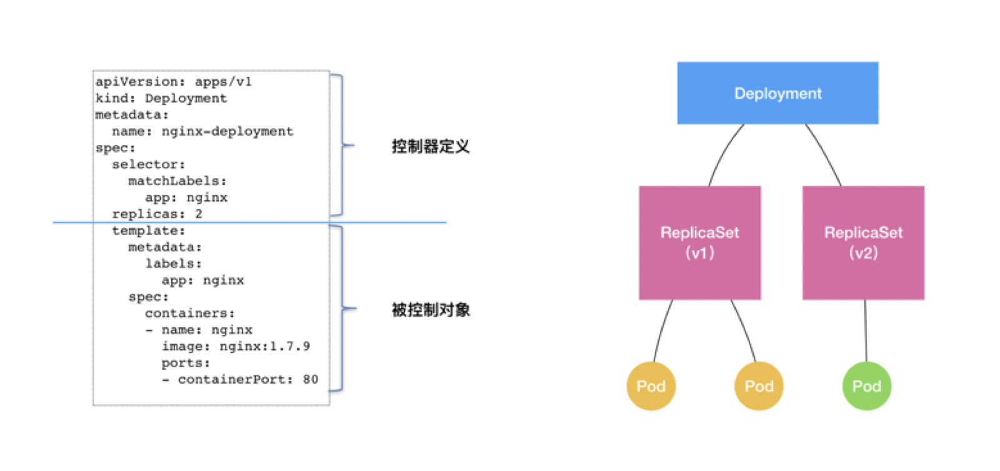
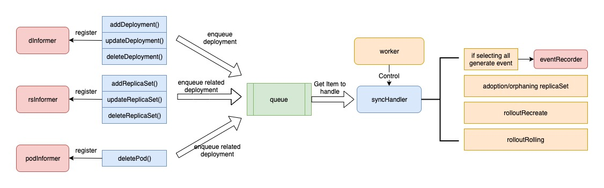
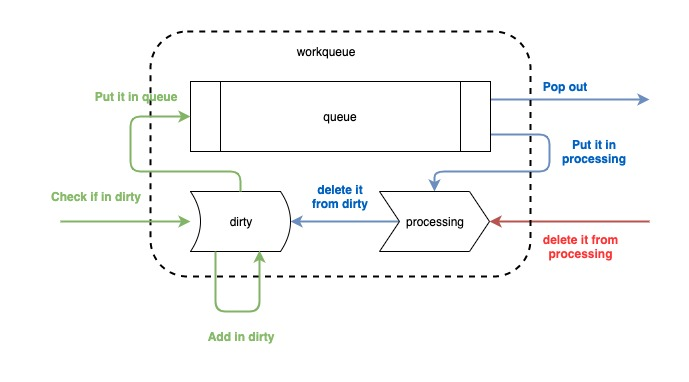
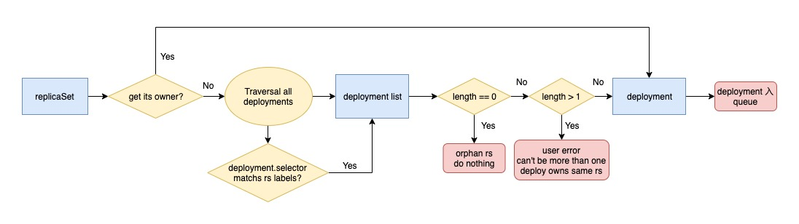

<!-- START doctoc generated TOC please keep comment here to allow auto update -->
<!-- DON'T EDIT THIS SECTION, INSTEAD RE-RUN doctoc TO UPDATE -->
**Table of Contents**  *generated with [DocToc](https://github.com/thlorenz/doctoc)*

- [Deployment controller](#deployment-controller)
  - [Deployment与控制器模式](#deployment%E4%B8%8E%E6%8E%A7%E5%88%B6%E5%99%A8%E6%A8%A1%E5%BC%8F)
  - [K8s是怎么管理Deployment的?](#k8s%E6%98%AF%E6%80%8E%E4%B9%88%E7%AE%A1%E7%90%86deployment%E7%9A%84)
  - [架构解析](#%E6%9E%B6%E6%9E%84%E8%A7%A3%E6%9E%90)
    - [控制器数据结构](#%E6%8E%A7%E5%88%B6%E5%99%A8%E6%95%B0%E6%8D%AE%E7%BB%93%E6%9E%84)
    - [控制器工作流程](#%E6%8E%A7%E5%88%B6%E5%99%A8%E5%B7%A5%E4%BD%9C%E6%B5%81%E7%A8%8B)
    - [workqueue](#workqueue)
    - [replicaSet的认领和弃养过程](#replicaset%E7%9A%84%E8%AE%A4%E9%A2%86%E5%92%8C%E5%BC%83%E5%85%BB%E8%BF%87%E7%A8%8B)
  - [event回调函数分析](#event%E5%9B%9E%E8%B0%83%E5%87%BD%E6%95%B0%E5%88%86%E6%9E%90)
    - [pod删除事件回调函数](#pod%E5%88%A0%E9%99%A4%E4%BA%8B%E4%BB%B6%E5%9B%9E%E8%B0%83%E5%87%BD%E6%95%B0)
  - [syncDeployment()流程分析](#syncdeployment%E6%B5%81%E7%A8%8B%E5%88%86%E6%9E%90)
  - [参考文献](#%E5%8F%82%E8%80%83%E6%96%87%E7%8C%AE)

<!-- END doctoc generated TOC please keep comment here to allow auto update -->


# Deployment controller

## Deployment与控制器模式

在`K8s`中，`pod`是最小的资源单位，而`pod`的副本管理是通过`ReplicaSet(RS) `实现的。
而`deployment`实则是基于`RS`做了更上层的工作。



这就是`Kubernetes`的控制器模式，顶层资源通过控制下层资源，来拓展新能力。

`deployment`并没有直接对`pod`进行管理，
是通过管理`rs`来实现对`pod`的副本控制。
`deployment`通过对`rs`的控制实现了版本管理：
每次发布对应一个版本，每个版本有一个`rs`，在注解中标识版本号，

而`rs`再每次根据`pod template`和副本数运行相应的`pod`。
`deployment`只需要保证任何情况下`rs`的状态都在预期，
`rs`保证任何情况下`pod`的状态都在预期。

## K8s是怎么管理Deployment的?

`Kubernetes`的`API`和控制器都是基于水平触发的，可以促进系统的自我修复和周期协调。

> 什么是水平触发？

水平触发这个概念来自硬件的中断，中断可以是水平触发，也可以是边缘触发：

---
- 水平触发： 系统仅依赖于当前状态。即使系统错过了某个事件（可能因为故障挂掉了），
当它恢复时，依然可以通过查看信号的当前状态来做出正确的响应
---
- 边缘触发： 系统不仅依赖于当前状态，
还依赖于过去的状态。如果系统错过了某个事件（“边缘”），则必须重新查看该事件才能恢复系统。
---
> `Kubernetes`水平触发的`API`实现方式原理

控制器监视资源对象的实际状态， 并与对象期望的状态进行对比，然后调整实际状态，使之与期望状态相匹配。

水平触发的`API`也叫声明式`API`，而监控`deployment`资源对象并确定符合预期的控制器就是`deployment controller`，
对应的`rs`的控制器就是`rs controller`。

## 架构解析

### 控制器数据结构

[DeploymentController](../../../pkg/controller/deployment/deployment_controller.go)

- `rsControl`: 一个`ReplicaSet Controller`的工具，用来对`rs`进行认领和弃养工作
- `client`: 与`APIServer`通信的`client`
- `eventRecorder`: 事件管理器，记录`deployment`控制器的`event`
- `syncHandler`: 同步`deployment`期望状态的函数
- `enqueueDeployment`: 将`deployment`入`queue`的方法
- `dLister`: 从`Informer`存储获取`deployment`对象方法
- `rsLister`: 从`Informer`存储获取`ReplicaSet`对象方法
- `podLister`: 从`Informer`存储获取`pod`对象方法
- `dListerSynced`: 标识`shared informer store`中`deployment`是否被同步
- `rsListerSynced`: 标识`shared informer store`中`ReplicaSet`是否被同步
- `podListerSynced`: 标识`shared informer store`中`pod`是否被同步
- `queue`: 就是`workqueue`，`deployment,replicaSet,pod`发生变化时，都会将对应的`deployment`推入这个`queue`， 
`syncHandler()`方法统一从`workqueue`中处理`deployment`。

```go
type DeploymentController struct {
	// rsControl is used for adopting/releasing replica sets.
	rsControl     controller.RSControlInterface
	client        clientset.Interface
	eventRecorder record.EventRecorder

	// To allow injection of syncDeployment for testing.
	syncHandler func(dKey string) error
	// used for unit testing
	enqueueDeployment func(deployment *apps.Deployment)

	// dLister can list/get deployments from the shared informer's store
	dLister appslisters.DeploymentLister
	// rsLister can list/get replica sets from the shared informer's store
	rsLister appslisters.ReplicaSetLister
	// podLister can list/get pods from the shared informer's store
	podLister corelisters.PodLister

	// dListerSynced returns true if the Deployment store has been synced at least once.
	// Added as a member to the struct to allow injection for testing.
	dListerSynced cache.InformerSynced
	// rsListerSynced returns true if the ReplicaSet store has been synced at least once.
	// Added as a member to the struct to allow injection for testing.
	rsListerSynced cache.InformerSynced
	// podListerSynced returns true if the pod store has been synced at least once.
	// Added as a member to the struct to allow injection for testing.
	podListerSynced cache.InformerSynced

	// Deployments that need to be synced
	queue workqueue.RateLimitingInterface
}
```

### 控制器工作流程



- `deployment controller`利用了`informer`的工作能力，实现了资源的监听， 同时与其他`controller`协同工作。
主要使用了三个`shared informer`:
    - `deployment informer`
    - `rs informer`
    - `pod informer`
---
首先`deployment controller`会向三个`shared informer`中注册钩子函数，三个钩子函数会在相应事件到来时，
将相关的`deployment`推进`workqueue`中。

- `deployment controller`启动时会有一个`worker`来控制`syncHandler`函数，
实时地将`workqueue`中的`item`推出，根据`item`来执行任务。 主要包括：
    - 领养和弃养`rs`
    - 向`eventRecorder`分发事件
    - 根据升级策略决定如何处理下级资源
### workqueue

首先看看`workqueue`, 也就是上图的`queue`,这个队列是用来辅助`informer`对事件进行分发的队列。整个流程可以梳理为下图。



可以看到,`workqueue`分为了三个部分:
1. 一个先入先出的队列，由切片来实现
2. 名为`dirty`的`map`
3. 名为`processing`的`map`
---
整个工作流程分为三个动作，分别为`add`,`get`,`done`

---
- `add`是将消息推入队列,消息时从`informer`过来的，其实过来的消息并不是事件全部，而是资源`key`，
即`namespace/name`，以这种形式通知业务逻辑有资源的变更事件过来了，需要拿着这个`key`去`indexer`中获取具体资源。 

如上图绿色的过程所示，在消息进行之后，先检查`dirty`中是否存在，若已存在，不做任何处理，表明事件已经在队列中，不需要重复处理；
若`dirty`中不存在，则将该`key`存入`dirty`中（将其作`map`的键，值为空结构体），再推入队列一份。

- `get`是`handle`函数从队列中获取`key`的过程。
将`key`从队列中`pop`出来的同时，会将其放入`processing`中，并删除其在`dirty`的索引。

这一步的原因是将`item`放入`processing`中标记其正在被处理，
同时从`dirty`中删除则不影响后面的事件入队列。


- `done`则是`handle`在处理完`key`之后，必须执行的一步，
相当于给`workqueue`发一个`ack`，表明我已经处理完毕，该动作仅仅将其从`processing`中删除。

---
有了这个小而美的先入先出的队列，我们就可以避免资源的多个事件发生时，
从`indexer`中重复获取资源的事情发生了。下面来梳理`deployment controller`的具体流程。

### replicaSet的认领和弃养过程 

在`deployment controller`的工作流程中，可以注意到除了`deployment`的三个钩子函数，
还有`rs`和`pod`的钩子函数，在`rs`的三个钩子函数中，涉及到了`deployment`对`rs`的领养和弃养过程。

> `rs`认亲

首先来看`rs`的认亲过程：



在`rs`的三个钩子函数中，都会涉及到认亲的过程:

1. 当监听到`rs`的变化后，会根据`rs`的`ownerReferences`字段找到对应的`deployment`入`queue`；
若该字段为空，意味着这是个孤儿`rs`，启动`rs`认亲机制。
2. 认亲过程首先是遍历所有的`deployment`，判断`deployment`的`selector`是否与当前`rs`的`labels`相匹配，
找到所有与之匹配的`deployment`。
3. 然后判断总共有多少个`deployment`，若为`0`个，就直接返回，没有人愿意认领，什么都不做，认领过程结束；
若大于`1`个，抛错出去，因为这是不正常的行为，不允许多个`deployment`同时拥有同一个`rs`;
若有且仅有一个`deployment`与之匹配，那么就找到了愿意领养的`deployment`，将其入`queue`。

以[RS AddFunc回调函数为例](../../../pkg/controller/deployment/deployment_controller.go)

```go
func (dc *DeploymentController) addReplicaSet(obj interface{}) {
	// 转化为rs对象
	rs := obj.(*apps.ReplicaSet)
    // 判断是否存在删除时间戳字段
	if rs.DeletionTimestamp != nil {
		// On a restart of the controller manager, it's possible for an object to
		// show up in a state that is already pending deletion.
		dc.deleteReplicaSet(rs)
		return
	}

	// If it has a ControllerRef, that's all that matters.
	// 获取`ownerReferences`字段值
	if controllerRef := metav1.GetControllerOf(rs); controllerRef != nil {
		d := dc.resolveControllerRef(rs.Namespace, controllerRef)
		if d == nil {
			return
		}
		klog.V(4).Infof("ReplicaSet %s added.", rs.Name)
		dc.enqueueDeployment(d)
		return
	}

	// 如果`ownerReferences`字段为空，遍历deployment，判断是否存在与之匹配的deployment(selector)
	ds := dc.getDeploymentsForReplicaSet(rs)
	if len(ds) == 0 {
		return
	}
	klog.V(4).Infof("Orphan ReplicaSet %s added.", rs.Name)
	for _, d := range ds {
		dc.enqueueDeployment(d)
	}
}
```

## event回调函数分析

### pod删除事件回调函数

```go
func (dc *DeploymentController) deletePod(obj interface{}) {
	pod, ok := obj.(*v1.Pod)

	// When a delete is dropped, the relist will notice a pod in the store not
	// in the list, leading to the insertion of a tombstone object which contains
	// the deleted key/value. Note that this value might be stale. If the Pod
	// changed labels the new deployment will not be woken up till the periodic resync.
	if !ok {
		tombstone, ok := obj.(cache.DeletedFinalStateUnknown)
		if !ok {
			utilruntime.HandleError(fmt.Errorf("Couldn't get object from tombstone %#v", obj))
			return
		}
		pod, ok = tombstone.Obj.(*v1.Pod)
		if !ok {
			utilruntime.HandleError(fmt.Errorf("Tombstone contained object that is not a pod %#v", obj))
			return
		}
	}
	klog.V(4).Infof("Pod %s deleted.", pod.Name)
	if d := dc.getDeploymentForPod(pod); d != nil && d.Spec.Strategy.Type == apps.RecreateDeploymentStrategyType {
		// Sync if this Deployment now has no more Pods.
		rsList, err := util.ListReplicaSets(d, util.RsListFromClient(dc.client.AppsV1()))
		if err != nil {
			return
		}
		podMap, err := dc.getPodMapForDeployment(d, rsList)
		if err != nil {
			return
		}
		numPods := 0
		for _, podList := range podMap {
			numPods += len(podList)
		}
		if numPods == 0 {
			dc.enqueueDeployment(d)
		}
	}
}
```

## syncDeployment()流程分析

1. 从`informer cache`中获取`deployment`对象
2. 判断`selecor`是否为空
3. 获取`deployment`对应的所有`rs`，通过`LabelSelector`进行匹配
4. 获取当前`Deployment`对象关联的`pod`，并根据`rs.UID`对`pod`进行分类
5. 如果该`deployment`处于删除状态，是的话则更新其`status`后返回
6. 检查是否处于`pause`状态，是的话执行逻辑后返回
7. 检查是否为回滚操作，是的话执行逻辑后返回
8. 检查`deployment`是否处于`scale`状态，是的话执行逻辑后返回
9. 更新操作

可以看出对于`deployment`的删除、暂停恢复、扩缩容以及更新操作都是在`syncDeployment`方法中进行处理的，
最终是通过调用`syncStatusOnly、sync、rollback、rolloutRecreate、rolloutRolling`这几个方法来处理的，
其中`syncStatusOnly`和`sync`都是更新`Deployment`的`Status`，`rollback`是用来回滚的，
`rolloutRecreate`和`rolloutRolling`是根据不同的更新策略来更新`Deployment`的， 下面就来看看这些操作的具体实现。

从`syncDeployment`中执行顺序可知以上几个操作的优先级为：

```
delete > pause > rollback > scale > rollout
```

---
```go
func (dc *DeploymentController) syncDeployment(key string) error {
	startTime := time.Now()
	klog.V(4).Infof("Started syncing deployment %q (%v)", key, startTime)
	defer func() {
		klog.V(4).Infof("Finished syncing deployment %q (%v)", key, time.Since(startTime))
	}()

	// 获取deployment的命名空间与名称
	namespace, name, err := cache.SplitMetaNamespaceKey(key)
	if err != nil {
		return err
	}

	// 1、从本地缓存中获取该deployment对象
	deployment, err := dc.dLister.Deployments(namespace).Get(name)
	if errors.IsNotFound(err) {
		klog.V(2).Infof("Deployment %v has been deleted", key)
		return nil
	}
	if err != nil {
		return err
	}

	// Deep-copy otherwise we are mutating our cache.
	// TODO: Deep-copy only when needed.
	d := deployment.DeepCopy()

	// 2、判断 selecor 是否为空
	everything := metav1.LabelSelector{}
	if reflect.DeepEqual(d.Spec.Selector, &everything) {
		dc.eventRecorder.Eventf(d, v1.EventTypeWarning, "SelectingAll", "This deployment is selecting all pods. A non-empty selector is required.")
		if d.Status.ObservedGeneration < d.Generation {
			d.Status.ObservedGeneration = d.Generation
			dc.client.AppsV1().Deployments(d.Namespace).UpdateStatus(context.TODO(), d, metav1.UpdateOptions{})
		}
		return nil
	}
    // 3、获取 deployment 对应的所有 rs，通过 LabelSelector 进行匹配
	// List ReplicaSets owned by this Deployment, while reconciling ControllerRef
	// through adoption/orphaning.
	rsList, err := dc.getReplicaSetsForDeployment(d)
	if err != nil {
		return err
	}
	// List all Pods owned by this Deployment, grouped by their ReplicaSet.
	// Current uses of the podMap are:
	//
	// * check if a Pod is labeled correctly with the pod-template-hash label.
	// * check that no old Pods are running in the middle of Recreate Deployments.
	// 4、获取当前 Deployment 对象关联的 pod，并根据 rs.UID 对 pod 进行分类
	podMap, err := dc.getPodMapForDeployment(d, rsList)
	if err != nil {
		return err
	}

	// 5、如果该 deployment 处于删除状态，则更新其 status
	if d.DeletionTimestamp != nil {
		return dc.syncStatusOnly(d, rsList)
	}

	// Update deployment conditions with an Unknown condition when pausing/resuming
	// a deployment. In this way, we can be sure that we won't timeout when a user
	// resumes a Deployment with a set progressDeadlineSeconds.
	// 6、检查是否处于 pause 状态
	if err = dc.checkPausedConditions(d); err != nil {
		return err
	}

	if d.Spec.Paused {
		return dc.sync(d, rsList)
	}

	// rollback is not re-entrant in case the underlying replica sets are updated with a new
	// revision so we should ensure that we won't proceed to update replica sets until we
	// make sure that the deployment has cleaned up its rollback spec in subsequent enqueues.
	// 7、检查是否为回滚操作
	if getRollbackTo(d) != nil {
		return dc.rollback(d, rsList)
	}
	
	// 8、检查 deployment 是否处于 scale 状态
	scalingEvent, err := dc.isScalingEvent(d, rsList)
	if err != nil {
		return err
	}
	if scalingEvent {
		return dc.sync(d, rsList)
	}

	// 9、更新操作
	switch d.Spec.Strategy.Type {
	case apps.RecreateDeploymentStrategyType:
		return dc.rolloutRecreate(d, rsList, podMap)
	case apps.RollingUpdateDeploymentStrategyType:
		return dc.rolloutRolling(d, rsList)
	}
	return fmt.Errorf("unexpected deployment strategy type: %s", d.Spec.Strategy.Type)
}
```

### 删除操作解析

> 检测对象的`metadata`中是否含有`DeletionTimestamp`字段

```go
if d.DeletionTimestamp != nil {
		return dc.syncStatusOnly(d, rsList)
	}
```

> `syncStatusOnly()`

```go
func (dc *DeploymentController) syncStatusOnly(d *apps.Deployment, rsList []*apps.ReplicaSet) error {
	newRS, oldRSs, err := dc.getAllReplicaSetsAndSyncRevision(d, rsList, false)
	if err != nil {
		return err
	}

	allRSs := append(oldRSs, newRS)
	return dc.syncDeploymentStatus(allRSs, newRS, d)
}
```


## 参考文献

- [deployment controller 源码分析](http://www.tianfeiyu.com/?p=2900)
- [图解 Deployment Controller 工作流程](https://blog.hdls.me/15763918313590.html)