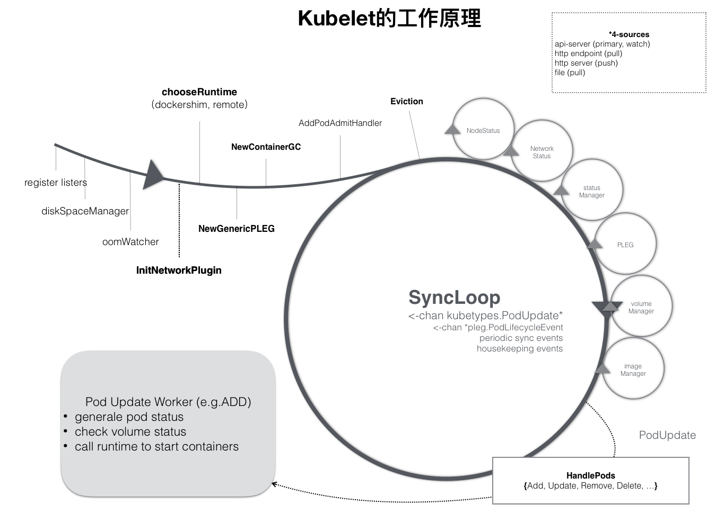
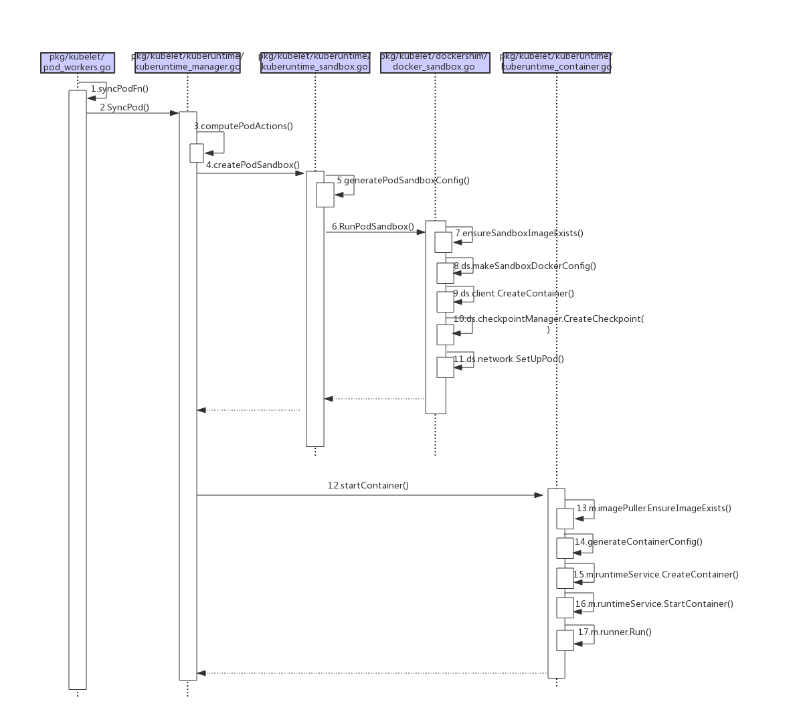

- [kubelet创建pod的流程](#kubelet%E5%88%9B%E5%BB%BApod%E7%9A%84%E6%B5%81%E7%A8%8B)
  - [kubelet创建pod的流程](#kubelet%E5%88%9B%E5%BB%BApod%E7%9A%84%E6%B5%81%E7%A8%8B-1)
    - [1、kubelet 的控制循环（syncLoop）](#1kubelet-%E7%9A%84%E6%8E%A7%E5%88%B6%E5%BE%AA%E7%8E%AFsyncloop)
    - [2.监听pod变化](#2%E7%9B%91%E5%90%ACpod%E5%8F%98%E5%8C%96)
    - [3.处理新增pod](#3%E5%A4%84%E7%90%86%E6%96%B0%E5%A2%9Epod)
    - [4.下发任务（dispatchWork）进行创建](#4%E4%B8%8B%E5%8F%91%E4%BB%BB%E5%8A%A1dispatchwork%E8%BF%9B%E8%A1%8C%E5%88%9B%E5%BB%BA)
    - [5.更新事件的channel（UpdatePod）](#5%E6%9B%B4%E6%96%B0%E4%BA%8B%E4%BB%B6%E7%9A%84channelupdatepod)
    - [6.调用syncPodFn方法同步pod（managePodLoop）](#6%E8%B0%83%E7%94%A8syncpodfn%E6%96%B9%E6%B3%95%E5%90%8C%E6%AD%A5podmanagepodloop)
    - [7.完成创建容器前的准备工作（SyncPod）](#7%E5%AE%8C%E6%88%90%E5%88%9B%E5%BB%BA%E5%AE%B9%E5%99%A8%E5%89%8D%E7%9A%84%E5%87%86%E5%A4%87%E5%B7%A5%E4%BD%9Csyncpod)
    - [8.创建容器](#8%E5%88%9B%E5%BB%BA%E5%AE%B9%E5%99%A8)
    - [9、启动容器](#9%E5%90%AF%E5%8A%A8%E5%AE%B9%E5%99%A8)
    
[原文地址](https://cloud.tencent.com/developer/article/1553943)

# kubelet创建pod的流程



`kubelet`的工作核心就是在围绕着不同的生产者生产出来的不同的有关`pod`的消息，
来调用相应的消费者（不同的子模块）完成不同的行为(创建和删除`pod`等)，
即图中的控制循环（`SyncLoop`），通过不同的事件驱动这个控制循环运行。

本文仅分析新建`pod`的流程，当一个`pod`完成调度，与一个`node`绑定起来之后，
这个`pod`就会触发`kubelet`在循环控制里注册的`handler`， 上图中的`HandlePods`部分。

此时，通过检查`pod`在`kubelet`内存中的状态，`kubelet`就能判断出这是一个新调度过来的`pod`，
从而触发`Handler`里的`ADD`事件对应的逻辑处理。

然后`kubelet`会为这个`pod`生成对应的`podStatus`，接着检查`pod`所声明的`volume`是不是准备好了，
然后调用下层的容器运行时。如果是`update`事件的话，`kubelet`就会根据`pod`对象具体的变更情况，
调用下层的容器运行时进行容器的重建。

## kubelet创建pod的流程



### 1、kubelet 的控制循环（syncLoop）

[syncLoop](../../pkg/kubelet/kubelet.go)

`syncLoop`是处理更改的主循环。它监视来自三个通道(`file`、`apiserver`和`http`)的更改，并创建它们的联合。
对于监控到的任何新变更，`kubelet`都将针对所需状态和运行状态进行`Pod`同步。
即使没有需要更新的`pod`配置，`kubelet`也会定时去做同步和清理`pod`的工作。

1. `syncLoop`中首先定义了一个`syncTicker`和`housekeepingTicker`
    - `syncTicker`每秒检测一次是否有需要同步的`pod workers`
    - `housekeepingTicker`每两秒检测一次是否有需要清理的`pod`
2. 然后在`for`循环中一直调用`syncLoopIteration`
   - 如果在每次循环过程中出现比较严重的错误，`kubelet`会记录到`runtimeState`中，
   遇到错误间隔`x`秒后继续循环，`x`初始`0.2`，最大`5`（0.2 -> 0.4 -> 0.8 -> 1.6 -> 3.2 -> 5 -> 5 -> ...）

```go
func (kl *Kubelet) syncLoop(updates <-chan kubetypes.PodUpdate, handler SyncHandler) {
	klog.Info("Starting kubelet main sync loop.")
	// 1.定义了`syncTicker`和`housekeepingTicker`
	syncTicker := time.NewTicker(time.Second)
	defer syncTicker.Stop()
	housekeepingTicker := time.NewTicker(housekeepingPeriod)
	defer housekeepingTicker.Stop()
	plegCh := kl.pleg.Watch()
	const (
		base   = 100 * time.Millisecond
		max    = 5 * time.Second
		factor = 2
	)
	duration := base
	// Responsible for checking limits in resolv.conf
	// The limits do not have anything to do with individual pods
	// Since this is called in syncLoop, we don't need to call it anywhere else
	if kl.dnsConfigurer != nil && kl.dnsConfigurer.ResolverConfig != "" {
		kl.dnsConfigurer.CheckLimitsForResolvConf()
	}

	for {
		if err := kl.runtimeState.runtimeErrors(); err != nil {
			klog.Errorf("skipping pod synchronization - %v", err)
			// exponential backoff
			time.Sleep(duration)
			// 返回最小的，依次0.2 -> 0.4 -> 0.8 -> 1.6 -> 3.2 -> 5 -> 5 -> ...
			duration = time.Duration(math.Min(float64(max), factor*float64(duration)))
			continue
		}
		// reset backoff if we have a success
		duration = base
		// 记录时间
		kl.syncLoopMonitor.Store(kl.clock.Now())
		if !kl.syncLoopIteration(updates, handler, syncTicker.C, housekeepingTicker.C, plegCh) {
			break
		}
		kl.syncLoopMonitor.Store(kl.clock.Now())
	}
}
```

### 2.监听pod变化

> `syncLoopIteration()`函数解析

`syncLoopIteration`从各种通道读取数据，并将`pods`分派到给`handler`处理。

参数解析:
- `handler`: 接收`pod`分配的回调函数
- `configCh`: 读取配置事件的通道，该信息源由`kubeDeps`对象中的`PodConfig`子模块提供，
该模块将同时`watch 3`个不同来源的`pod`信息的变化（`file，http，apiserver`），
一旦某个来源的`pod`信息发生了更新（创建/更新/删除），这个`channel`中就会出现被更新的`pod`信息和更新的具体操作。
- `syncCh`: 定时器管道，每隔一秒去同步最新保存的`pod`状态
- `housekeepingCh`: `housekeeping`事件的管道，做`pod`清理工作
- `plegCh`: 该信息源由`kubelet`对象中的`pleg`子模块提供，
该模块主要用于周期性地向`container runtime`查询当前所有容器的状态，如果状态发生变化，则这个`channel`产生事件。
- `kubelet liveness manager`: 健康检查发现某个`pod`不可用，`kubelet`将根据`Pod`的`restartPolicy`自动执行正确的操作

这里有一个适当的地方需要注意，尽管在语法上与`switch`语句相似，但是如果在计算`select`时有多个通道准备读取，
那么`select`中的`case`语句将以伪随机顺序进行计算。
换句话说，`case`语句是按随机顺序计算的，如果多个通道有事件，则不能假定`case`语句是按顺序计算的。

```go
func (kl *Kubelet) syncLoopIteration(configCh <-chan kubetypes.PodUpdate, handler SyncHandler,
	syncCh <-chan time.Time, housekeepingCh <-chan time.Time, plegCh <-chan *pleg.PodLifecycleEvent) bool {
	select {
	case u, open := <-configCh:
		// Update from a config source; dispatch it to the right handler
		// callback.
		if !open {
			klog.Errorf("Update channel is closed. Exiting the sync loop.")
			return false
		}

		switch u.Op {
		case kubetypes.ADD:
			klog.V(2).Infof("SyncLoop (ADD, %q): %q", u.Source, format.Pods(u.Pods))
			// After restarting, kubelet will get all existing pods through
			// ADD as if they are new pods. These pods will then go through the
			// admission process and *may* be rejected. This can be resolved
			// once we have checkpointing.
			handler.HandlePodAdditions(u.Pods)
		case kubetypes.UPDATE:
			klog.V(2).Infof("SyncLoop (UPDATE, %q): %q", u.Source, format.PodsWithDeletionTimestamps(u.Pods))
			handler.HandlePodUpdates(u.Pods)
		case kubetypes.REMOVE:
			klog.V(2).Infof("SyncLoop (REMOVE, %q): %q", u.Source, format.Pods(u.Pods))
			handler.HandlePodRemoves(u.Pods)
		case kubetypes.RECONCILE:
			klog.V(4).Infof("SyncLoop (RECONCILE, %q): %q", u.Source, format.Pods(u.Pods))
			handler.HandlePodReconcile(u.Pods)
		case kubetypes.DELETE:
			klog.V(2).Infof("SyncLoop (DELETE, %q): %q", u.Source, format.Pods(u.Pods))
			// DELETE is treated as a UPDATE because of graceful deletion.
			handler.HandlePodUpdates(u.Pods)
		case kubetypes.RESTORE:
			klog.V(2).Infof("SyncLoop (RESTORE, %q): %q", u.Source, format.Pods(u.Pods))
			// These are pods restored from the checkpoint. Treat them as new
			// pods.
			handler.HandlePodAdditions(u.Pods)
		case kubetypes.SET:
			// TODO: Do we want to support this?
			klog.Errorf("Kubelet does not support snapshot update")
		}

		if u.Op != kubetypes.RESTORE {
			// If the update type is RESTORE, it means that the update is from
			// the pod checkpoints and may be incomplete. Do not mark the
			// source as ready.

			// Mark the source ready after receiving at least one update from the
			// source. Once all the sources are marked ready, various cleanup
			// routines will start reclaiming resources. It is important that this
			// takes place only after kubelet calls the update handler to process
			// the update to ensure the internal pod cache is up-to-date.
			kl.sourcesReady.AddSource(u.Source)
		}
	case e := <-plegCh:
		if isSyncPodWorthy(e) {
			// PLEG event for a pod; sync it.
			if pod, ok := kl.podManager.GetPodByUID(e.ID); ok {
				klog.V(2).Infof("SyncLoop (PLEG): %q, event: %#v", format.Pod(pod), e)
				handler.HandlePodSyncs([]*v1.Pod{pod})
			} else {
				// If the pod no longer exists, ignore the event.
				klog.V(4).Infof("SyncLoop (PLEG): ignore irrelevant event: %#v", e)
			}
		}

		if e.Type == pleg.ContainerDied {
			if containerID, ok := e.Data.(string); ok {
				kl.cleanUpContainersInPod(e.ID, containerID)
			}
		}
	case <-syncCh:
		// Sync pods waiting for sync
		podsToSync := kl.getPodsToSync()
		if len(podsToSync) == 0 {
			break
		}
		klog.V(4).Infof("SyncLoop (SYNC): %d pods; %s", len(podsToSync), format.Pods(podsToSync))
		handler.HandlePodSyncs(podsToSync)
	case update := <-kl.livenessManager.Updates():
		if update.Result == proberesults.Failure {
			// The liveness manager detected a failure; sync the pod.

			// We should not use the pod from livenessManager, because it is never updated after
			// initialization.
			pod, ok := kl.podManager.GetPodByUID(update.PodUID)
			if !ok {
				// If the pod no longer exists, ignore the update.
				klog.V(4).Infof("SyncLoop (container unhealthy): ignore irrelevant update: %#v", update)
				break
			}
			klog.V(1).Infof("SyncLoop (container unhealthy): %q", format.Pod(pod))
			handler.HandlePodSyncs([]*v1.Pod{pod})
		}
	case <-housekeepingCh:
		if !kl.sourcesReady.AllReady() {
			// If the sources aren't ready or volume manager has not yet synced the states,
			// skip housekeeping, as we may accidentally delete pods from unready sources.
			klog.V(4).Infof("SyncLoop (housekeeping, skipped): sources aren't ready yet.")
		} else {
			klog.V(4).Infof("SyncLoop (housekeeping)")
			if err := handler.HandlePodCleanups(); err != nil {
				klog.Errorf("Failed cleaning pods: %v", err)
			}
		}
	}
	return true
}
```

由于这里我们只讨论创建`pod`的流程，所以接下来我们主要分析`case kubetypes.ADD:`逻辑

### 3.处理新增pod

> `handler.HandlePodAdditions(u.Pods)`逻辑分析

当新增`pod`事件来临时，回调函数执行以下操作:
1. 把所有的`pod`按照创建日期进行排序，保证最先创建的`pod`会最先被处理
2. 把`pod`们加入到`podManager`中，`podManager`子模块负责管理这台机器上的`pod`的信息，
`pod`和`mirrorPod`之间的对应关系等等。
所有被管理的`pod`都要出现在里面，如果`podManager`中找不到某个`pod`，则意味着它已在`apiserver`中被删除，不需要任何操作(除了清理)，具体添加流程如下：
   - 获取当前节点`podManager`所有被管理的`pod`集合`existingPods`
   - `podManager`添加新增`pod`,如果`Pod`已存在则更新`pod`信息
   - 如果是`mirror pod`(静态`pod`)调用其单独的方法
   - 从`existingPods`过滤出当前节点存活状态的`pod`
   - 通过`canAdmitPod`方法校验`pod`能否在该计算节点创建(如:磁盘空间是否满足),如果不能返回原因
3. 通过`dispatchWork`把创建`pod`的工作下发给`podWorkers`子模块做异步处理
4. 在`probeManager`中添加`pod`，如果`pod`中定义了`readiness`和`liveness`健康检查，启动`goroutine`定期进行检测
---

`static pod`是由`kubelet`直接管理的，`k8s apiserver`并不会感知到`static pod`的存在，
当然也不会和任何一个`rs`关联上，完全是由`kubelet`进程来监管，并在它异常时负责重启。
`Kubelet`会通过`apiserver`为每一个`static pod`创建一个对应的`mirror pod`，
如此以来就可以可以通过`kubectl`命令查看对应的`pod`,并且可以通过`kubectl logs`命令直接查看到`static pod`的日志信息。

```go
func (kl *Kubelet) HandlePodAdditions(pods []*v1.Pod) {
	start := kl.clock.Now()
	sort.Sort(sliceutils.PodsByCreationTime(pods))
	for _, pod := range pods {
		// 获取podManager所有被管理的pod
		existingPods := kl.podManager.GetPods()
		// Always add the pod to the pod manager. Kubelet relies on the pod
		// manager as the source of truth for the desired state. If a pod does
		// not exist in the pod manager, it means that it has been deleted in
		// the apiserver and no action (other than cleanup) is required.
		kl.podManager.AddPod(pod)

		if kubetypes.IsMirrorPod(pod) {
			kl.handleMirrorPod(pod, start)
			continue
		}

		if !kl.podIsTerminated(pod) {
			// Only go through the admission process if the pod is not
			// terminated.

			// We failed pods that we rejected, so activePods include all admitted
			// pods that are alive.
			activePods := kl.filterOutTerminatedPods(existingPods)

			// Check if we can admit the pod; if not, reject it.
			// 校验`pod`能否在该计算节点创建(如:磁盘空间)
			if ok, reason, message := kl.canAdmitPod(activePods, pod); !ok {
				kl.rejectPod(pod, reason, message)
				continue
			}
		}
		mirrorPod, _ := kl.podManager.GetMirrorPodByPod(pod)
		kl.dispatchWork(pod, kubetypes.SyncPodCreate, mirrorPod, start)
		kl.probeManager.AddPod(pod)
	}
}
```

### 4.下发任务（dispatchWork）进行创建

> `dispatchWork()`函数解析

`dispatchWorker`的主要作用，通过调用`UpdatePod`把某个对`Pod`的操作（创建/更新/删除）下发给`podWorkers`。

主要流程如下:
1. 判断`pod`是否已经被删除
2. 这里涉及两个状态：
   - `containersTerminal`: `pod`关联的容器均非`waiting`与`teminal`状态，则值为`true`
   - `podWorkerTerminal`: `pod`状态为`Failed`或`Succeeded`或`containersTerminal`为`true`时，其值为`true`

```go
func (kl *Kubelet) dispatchWork(pod *v1.Pod, syncType kubetypes.SyncPodType, mirrorPod *v1.Pod, start time.Time) {
	// check whether we are ready to delete the pod from the API server (all status up to date)
	containersTerminal, podWorkerTerminal := kl.podAndContainersAreTerminal(pod)
	if pod.DeletionTimestamp != nil && containersTerminal {
		klog.V(4).Infof("Pod %q has completed execution and should be deleted from the API server: %s", format.Pod(pod), syncType)
		kl.statusManager.TerminatePod(pod)
		return
	}

	// optimization: avoid invoking the pod worker if no further changes are possible to the pod definition
	if podWorkerTerminal {
		klog.V(4).Infof("Pod %q has completed, ignoring remaining sync work: %s", format.Pod(pod), syncType)
		return
	}

	// Run the sync in an async worker.
	kl.podWorkers.UpdatePod(&UpdatePodOptions{
		Pod:        pod,
		MirrorPod:  mirrorPod,
		UpdateType: syncType,
		OnCompleteFunc: func(err error) {
			if err != nil {
				metrics.PodWorkerDuration.WithLabelValues(syncType.String()).Observe(metrics.SinceInSeconds(start))
			}
		},
	})
	// Note the number of containers for new pods.
	if syncType == kubetypes.SyncPodCreate {
		metrics.ContainersPerPodCount.Observe(float64(len(pod.Spec.Containers)))
	}
}
```

### 5.更新事件的channel（UpdatePod）

`podWorkers`子模块主要的作用就是处理针对每一个的`Pod`的更新事件，
比如`Pod`的创建，删除，更新。而`podWorkers`采取的基本思路是：
为每一个`Pod`都单独创建一个`goroutine`和更新事件的`channel`，
`goroutine`会阻塞式的等待`channel`中的事件，并且对获取的事件进行处理
。而`podWorkers`对象自身则主要负责对更新事件进行下发。

```go
func (p *podWorkers) UpdatePod(options *UpdatePodOptions) {
	pod := options.Pod
	uid := pod.UID
	var podUpdates chan UpdatePodOptions
	var exists bool

	p.podLock.Lock()
	defer p.podLock.Unlock()
	// 如果当前 pod 还没有启动过 goroutine ，则启动 goroutine，并且创建 channel
	if podUpdates, exists = p.podUpdates[uid]; !exists {
		// We need to have a buffer here, because checkForUpdates() method that
		// puts an update into channel is called from the same goroutine where
		// the channel is consumed. However, it is guaranteed that in such case
		// the channel is empty, so buffer of size 1 is enough. 
		
		//创建 channel
		podUpdates = make(chan UpdatePodOptions, 1)
		p.podUpdates[uid] = podUpdates

		// Creating a new pod worker either means this is a new pod, or that the
		// kubelet just restarted. In either case the kubelet is willing to believe
		// the status of the pod for the first pod worker sync. See corresponding
		// comment in syncPod.
		
		// 启动 goroutine
		go func() {
			defer runtime.HandleCrash()
			p.managePodLoop(podUpdates)
		}()
	}
	
	// 下发更新事件
	if !p.isWorking[pod.UID] {
		p.isWorking[pod.UID] = true
		podUpdates <- *options
	} else {
		// if a request to kill a pod is pending, we do not let anything overwrite that request.
		update, found := p.lastUndeliveredWorkUpdate[pod.UID]
		if !found || update.UpdateType != kubetypes.SyncPodKill {
			p.lastUndeliveredWorkUpdate[pod.UID] = *options
		}
	}
}
```

### 6.调用syncPodFn方法同步pod（managePodLoop）

> `p.managePodLoop(podUpdates)`流程解析

`managePodLoop`调用`syncPodFn`方法去同步`pod`，
`syncPodFn`实际上就是`kubelet.SyncPod`。

```go
func (p *podWorkers) managePodLoop(podUpdates <-chan UpdatePodOptions) {
	var lastSyncTime time.Time
	for update := range podUpdates {
		err := func() error {
			podUID := update.Pod.UID
			// This is a blocking call that would return only if the cache
			// has an entry for the pod that is newer than minRuntimeCache
			// Time. This ensures the worker doesn't start syncing until
			// after the cache is at least newer than the finished time of
			// the previous sync.
			status, err := p.podCache.GetNewerThan(podUID, lastSyncTime)
			if err != nil {
				// This is the legacy event thrown by manage pod loop
				// all other events are now dispatched from syncPodFn
				p.recorder.Eventf(update.Pod, v1.EventTypeWarning, events.FailedSync, "error determining status: %v", err)
				return err
			}
			err = p.syncPodFn(syncPodOptions{
				mirrorPod:      update.MirrorPod,
				pod:            update.Pod,
				podStatus:      status,
				killPodOptions: update.KillPodOptions,
				updateType:     update.UpdateType,
			})
			lastSyncTime = time.Now()
			return err
		}()
		// notify the call-back function if the operation succeeded or not
		if update.OnCompleteFunc != nil {
			update.OnCompleteFunc(err)
		}
		if err != nil {
			// IMPORTANT: we do not log errors here, the syncPodFn is responsible for logging errors
			klog.Errorf("Error syncing pod %s (%q), skipping: %v", update.Pod.UID, format.Pod(update.Pod), err)
		}
		p.wrapUp(update.Pod.UID, err)
	}
}
```

在完成这次`sync`动作之后，会调用`wrapUp`函数，这个函数将会做几件事情:

- 将这个`pod`信息插入`kubelet`的`workQueue`队列中，等待下一次周期性的对这个`pod`的状态进行`sync`
- 将在这次`sync`期间堆积的没有能够来得及处理的最近一次`update`操作加入`goroutine`的事件`channel`中，立即处理。

> `wrapUp()`

```go
func (p *podWorkers) wrapUp(uid types.UID, syncErr error) {
	// Requeue the last update if the last sync returned error.
	switch {
	case syncErr == nil:
		// No error; requeue at the regular resync interval.
		p.workQueue.Enqueue(uid, wait.Jitter(p.resyncInterval, workerResyncIntervalJitterFactor))
	case strings.Contains(syncErr.Error(), NetworkNotReadyErrorMsg):
		// Network is not ready; back off for short period of time and retry as network might be ready soon.
		p.workQueue.Enqueue(uid, wait.Jitter(backOffOnTransientErrorPeriod, workerBackOffPeriodJitterFactor))
	default:
		// Error occurred during the sync; back off and then retry.
		p.workQueue.Enqueue(uid, wait.Jitter(p.backOffPeriod, workerBackOffPeriodJitterFactor))
	}
	p.checkForUpdates(uid)
}
```

### 7.完成创建容器前的准备工作（SyncPod）

在这个方法中，主要完成以下几件事情：

- 如果更新类型是删除`pod`，立即执行删除逻辑并返回
- 如果`pod`是一个静态`pod`，并且它的`mirror pod`仍然在优雅地终止，则直到旧的静态`pod`被优雅地终止前不启动新的静态`pod`
- 如果更新类型是创建，则记录`pod worker`启动延迟
- 用`pod`和`podStatus`生成最终的`API pod`状态
- 记录`pod`运行起来所需的时间
- 更新`pod`状态到`kubelet.statusManager`
- 检查`pod`是否能运行在本节点,主要是权限检查（是否能使用主机网络模式，是否可以以`privileged`权限运行等）。如果没有权限，就删除本地旧的`pod`并返回错误信息
- 如果启用了`Cgroups-per-qos`标志，则为`pod`创建`Cgroups`，并为它们应用资源参数。
  - 如果`pod`已经被终止，则不需要创建或更新`pod`的`cgroup`
- 如果是`static Pod`，就创建或者更新对应的`mirrorPod`
- 创建`pod`的数据目录，存放`volume`和`plugin`信息,如果定义了`pv`，等待所有的`volume mount`完成（`volumeManager`会在后台做这些事情）,
如果有`image secrets`，去`apiserver`获取对应的`secrets`数据
- 然后调用`kubelet.volumeManager`组件，等待它将`pod`所需要的所有外挂的`volume`都准备好。
- 调用`container runtime`的`SyncPod`方法，去实现真正的容器创建逻辑

这里所有的事情都和具体的容器没有关系，可以看到该方法是创建 pod 实体（即容器）之前需要完成的准备工作。

```go
func (kl *Kubelet) syncPod(o syncPodOptions) error {
	// pull out the required options
	pod := o.pod
	mirrorPod := o.mirrorPod
	podStatus := o.podStatus
	updateType := o.updateType
	
	// 是否为 删除 pod
	if updateType == kubetypes.SyncPodKill {
		killPodOptions := o.killPodOptions
		if killPodOptions == nil || killPodOptions.PodStatusFunc == nil {
			return fmt.Errorf("kill pod options are required if update type is kill")
		}
		apiPodStatus := killPodOptions.PodStatusFunc(pod, podStatus)
		kl.statusManager.SetPodStatus(pod, apiPodStatus)
		// we kill the pod with the specified grace period since this is a termination
		if err := kl.killPod(pod, nil, podStatus, killPodOptions.PodTerminationGracePeriodSecondsOverride); err != nil {
			kl.recorder.Eventf(pod, v1.EventTypeWarning, events.FailedToKillPod, "error killing pod: %v", err)
			// there was an error killing the pod, so we return that error directly
			utilruntime.HandleError(err)
			return err
		}
		return nil
	}

	// If the pod is a static pod and its mirror pod is still gracefully terminating,
	// we do not want to start the new static pod until the old static pod is gracefully terminated.
	podFullName := kubecontainer.GetPodFullName(pod)
	if kl.podKiller.IsMirrorPodPendingTerminationByPodName(podFullName) {
		return fmt.Errorf("pod %q is pending termination", podFullName)
	}

	// Latency measurements for the main workflow are relative to the
	// first time the pod was seen by the API server.
	var firstSeenTime time.Time
	if firstSeenTimeStr, ok := pod.Annotations[kubetypes.ConfigFirstSeenAnnotationKey]; ok {
		firstSeenTime = kubetypes.ConvertToTimestamp(firstSeenTimeStr).Get()
	}

	// Record pod worker start latency if being created
	// TODO: make pod workers record their own latencies
	if updateType == kubetypes.SyncPodCreate {
		if !firstSeenTime.IsZero() {
			// This is the first time we are syncing the pod. Record the latency
			// since kubelet first saw the pod if firstSeenTime is set.
			metrics.PodWorkerStartDuration.Observe(metrics.SinceInSeconds(firstSeenTime))
		} else {
			klog.V(3).Infof("First seen time not recorded for pod %q", pod.UID)
		}
	}

	// Generate final API pod status with pod and status manager status
	apiPodStatus := kl.generateAPIPodStatus(pod, podStatus)
	// The pod IP may be changed in generateAPIPodStatus if the pod is using host network. (See #24576)
	// TODO(random-liu): After writing pod spec into container labels, check whether pod is using host network, and
	// set pod IP to hostIP directly in runtime.GetPodStatus
	podStatus.IPs = make([]string, 0, len(apiPodStatus.PodIPs))
	for _, ipInfo := range apiPodStatus.PodIPs {
		podStatus.IPs = append(podStatus.IPs, ipInfo.IP)
	}

	if len(podStatus.IPs) == 0 && len(apiPodStatus.PodIP) > 0 {
		podStatus.IPs = []string{apiPodStatus.PodIP}
	}

	// Record the time it takes for the pod to become running.
	existingStatus, ok := kl.statusManager.GetPodStatus(pod.UID)
	if !ok || existingStatus.Phase == v1.PodPending && apiPodStatus.Phase == v1.PodRunning &&
		!firstSeenTime.IsZero() {
		metrics.PodStartDuration.Observe(metrics.SinceInSeconds(firstSeenTime))
	}

	runnable := kl.canRunPod(pod)
	
	if !runnable.Admit {
		// Pod is not runnable; update the Pod and Container statuses to why.
		apiPodStatus.Reason = runnable.Reason
		apiPodStatus.Message = runnable.Message
		// Waiting containers are not creating.
		const waitingReason = "Blocked"
		for _, cs := range apiPodStatus.InitContainerStatuses {
			if cs.State.Waiting != nil {
				cs.State.Waiting.Reason = waitingReason
			}
		}
		for _, cs := range apiPodStatus.ContainerStatuses {
			if cs.State.Waiting != nil {
				cs.State.Waiting.Reason = waitingReason
			}
		}
	}

	// Update status in the status manager
	kl.statusManager.SetPodStatus(pod, apiPodStatus) 
	
	// 如果 pod 非 running 状态则直接 kill 掉
	if !runnable.Admit || pod.DeletionTimestamp != nil || apiPodStatus.Phase == v1.PodFailed {
		var syncErr error
		if err := kl.killPod(pod, nil, podStatus, nil); err != nil {
			kl.recorder.Eventf(pod, v1.EventTypeWarning, events.FailedToKillPod, "error killing pod: %v", err)
			syncErr = fmt.Errorf("error killing pod: %v", err)
			utilruntime.HandleError(syncErr)
		} else {
			if !runnable.Admit {
				// There was no error killing the pod, but the pod cannot be run.
				// Return an error to signal that the sync loop should back off.
				syncErr = fmt.Errorf("pod cannot be run: %s", runnable.Message)
			}
		}
		return syncErr
	}

	// If the network plugin is not ready, only start the pod if it uses the host network
	if err := kl.runtimeState.networkErrors(); err != nil && !kubecontainer.IsHostNetworkPod(pod) {
		kl.recorder.Eventf(pod, v1.EventTypeWarning, events.NetworkNotReady, "%s: %v", NetworkNotReadyErrorMsg, err)
		return fmt.Errorf("%s: %v", NetworkNotReadyErrorMsg, err)
	}

	// Create Cgroups for the pod and apply resource parameters
	// to them if cgroups-per-qos flag is enabled.
	pcm := kl.containerManager.NewPodContainerManager()
	// If pod has already been terminated then we need not create
	// or update the pod's cgroup
	if !kl.podIsTerminated(pod) {
		// When the kubelet is restarted with the cgroups-per-qos
		// flag enabled, all the pod's running containers
		// should be killed intermittently and brought back up
		// under the qos cgroup hierarchy.
		// Check if this is the pod's first sync
		firstSync := true
		for _, containerStatus := range apiPodStatus.ContainerStatuses {
			if containerStatus.State.Running != nil {
				firstSync = false
				break
			}
		}
		// Don't kill containers in pod if pod's cgroups already
		// exists or the pod is running for the first time
		podKilled := false
		if !pcm.Exists(pod) && !firstSync {
			if err := kl.killPod(pod, nil, podStatus, nil); err == nil {
				podKilled = true
			}
		}
		// Create and Update pod's Cgroups
		// Don't create cgroups for run once pod if it was killed above
		// The current policy is not to restart the run once pods when
		// the kubelet is restarted with the new flag as run once pods are
		// expected to run only once and if the kubelet is restarted then
		// they are not expected to run again.
		// We don't create and apply updates to cgroup if its a run once pod and was killed above
		if !(podKilled && pod.Spec.RestartPolicy == v1.RestartPolicyNever) {
			if !pcm.Exists(pod) {
				if err := kl.containerManager.UpdateQOSCgroups(); err != nil {
					klog.V(2).Infof("Failed to update QoS cgroups while syncing pod: %v", err)
				}
				if err := pcm.EnsureExists(pod); err != nil {
					kl.recorder.Eventf(pod, v1.EventTypeWarning, events.FailedToCreatePodContainer, "unable to ensure pod container exists: %v", err)
					return fmt.Errorf("failed to ensure that the pod: %v cgroups exist and are correctly applied: %v", pod.UID, err)
				}
			}
		}
	}

	// Create Mirror Pod for Static Pod if it doesn't already exist
	if kubetypes.IsStaticPod(pod) {
		deleted := false
		if mirrorPod != nil {
			if mirrorPod.DeletionTimestamp != nil || !kl.podManager.IsMirrorPodOf(mirrorPod, pod) {
				// The mirror pod is semantically different from the static pod. Remove
				// it. The mirror pod will get recreated later.
				klog.Infof("Trying to delete pod %s %v", podFullName, mirrorPod.ObjectMeta.UID)
				var err error
				deleted, err = kl.podManager.DeleteMirrorPod(podFullName, &mirrorPod.ObjectMeta.UID)
				if deleted {
					klog.Warningf("Deleted mirror pod %q because it is outdated", format.Pod(mirrorPod))
				} else if err != nil {
					klog.Errorf("Failed deleting mirror pod %q: %v", format.Pod(mirrorPod), err)
				}
			}
		}
		if mirrorPod == nil || deleted {
			node, err := kl.GetNode()
			if err != nil || node.DeletionTimestamp != nil {
				klog.V(4).Infof("No need to create a mirror pod, since node %q has been removed from the cluster", kl.nodeName)
			} else {
				klog.V(4).Infof("Creating a mirror pod for static pod %q", format.Pod(pod))
				if err := kl.podManager.CreateMirrorPod(pod); err != nil {
					klog.Errorf("Failed creating a mirror pod for %q: %v", format.Pod(pod), err)
				}
			}
		}
	}

	// Make data directories for the pod
	if err := kl.makePodDataDirs(pod); err != nil {
		kl.recorder.Eventf(pod, v1.EventTypeWarning, events.FailedToMakePodDataDirectories, "error making pod data directories: %v", err)
		klog.Errorf("Unable to make pod data directories for pod %q: %v", format.Pod(pod), err)
		return err
	}

	// Volume manager will not mount volumes for terminated pods
	if !kl.podIsTerminated(pod) {
		// Wait for volumes to attach/mount
		if err := kl.volumeManager.WaitForAttachAndMount(pod); err != nil {
			kl.recorder.Eventf(pod, v1.EventTypeWarning, events.FailedMountVolume, "Unable to attach or mount volumes: %v", err)
			klog.Errorf("Unable to attach or mount volumes for pod %q: %v; skipping pod", format.Pod(pod), err)
			return err
		}
	}

	// Fetch the pull secrets for the pod
	pullSecrets := kl.getPullSecretsForPod(pod)

	// Call the container runtime's SyncPod callback
	result := kl.containerRuntime.SyncPod(pod, podStatus, pullSecrets, kl.backOff)
	kl.reasonCache.Update(pod.UID, result)
	if err := result.Error(); err != nil {
		// Do not return error if the only failures were pods in backoff
		for _, r := range result.SyncResults {
			if r.Error != kubecontainer.ErrCrashLoopBackOff && r.Error != images.ErrImagePullBackOff {
				// Do not record an event here, as we keep all event logging for sync pod failures
				// local to container runtime so we get better errors
				return err
			}
		}

		return nil
	}

	return nil
}
```

### 8.创建容器

`containerRuntime（pkg/kubelet/kuberuntime）`子模块的`SyncPod`函数才是真正完成`pod`容器实体的创建。

`syncPod`主要执行以下几个操作： 
1. 计算`sandbox`和`container`是否发生变化
2. 如果有必要的话杀死`sandbox`容器
3. 杀死不应该运行的`Pod`容器
4. 创建`sandbox`容器
5. 创建`ephemeral`容器
6. 启动`init`容器
7. 启动业务容器

`initContainers`可以有多个，多个`container`严格按照顺序启动，
只有当前一个`container`退出了以后，才开始启动下一个`container`。

> `SyncPod（）`

```go
// SyncPod syncs the running pod into the desired pod by executing following steps:
//
//  1. Compute sandbox and container changes.
//  2. Kill pod sandbox if necessary.
//  3. Kill any containers that should not be running.
//  4. Create sandbox if necessary.
//  5. Create ephemeral containers.
//  6. Create init containers.
//  7. Create normal containers.
func (m *kubeGenericRuntimeManager) SyncPod(pod *v1.Pod, podStatus *kubecontainer.PodStatus, pullSecrets []v1.Secret, backOff *flowcontrol.Backoff) (result kubecontainer.PodSyncResult) {
	// Step 1: Compute sandbox and container changes.
	podContainerChanges := m.computePodActions(pod, podStatus)
	klog.V(3).Infof("computePodActions got %+v for pod %q", podContainerChanges, format.Pod(pod))
	if podContainerChanges.CreateSandbox {
		ref, err := ref.GetReference(legacyscheme.Scheme, pod)
		if err != nil {
			klog.Errorf("Couldn't make a ref to pod %q: '%v'", format.Pod(pod), err)
		}
		if podContainerChanges.SandboxID != "" {
			m.recorder.Eventf(ref, v1.EventTypeNormal, events.SandboxChanged, "Pod sandbox changed, it will be killed and re-created.")
		} else {
			klog.V(4).Infof("SyncPod received new pod %q, will create a sandbox for it", format.Pod(pod))
		}
	}

	// Step 2: Kill the pod if the sandbox has changed.
	if podContainerChanges.KillPod {
		if podContainerChanges.CreateSandbox {
			klog.V(4).Infof("Stopping PodSandbox for %q, will start new one", format.Pod(pod))
		} else {
			klog.V(4).Infof("Stopping PodSandbox for %q because all other containers are dead.", format.Pod(pod))
		}

		killResult := m.killPodWithSyncResult(pod, kubecontainer.ConvertPodStatusToRunningPod(m.runtimeName, podStatus), nil)
		result.AddPodSyncResult(killResult)
		if killResult.Error() != nil {
			klog.Errorf("killPodWithSyncResult failed: %v", killResult.Error())
			return
		}

		if podContainerChanges.CreateSandbox {
			m.purgeInitContainers(pod, podStatus)
		}
	} else {
		// Step 3: kill any running containers in this pod which are not to keep.
		for containerID, containerInfo := range podContainerChanges.ContainersToKill {
			klog.V(3).Infof("Killing unwanted container %q(id=%q) for pod %q", containerInfo.name, containerID, format.Pod(pod))
			killContainerResult := kubecontainer.NewSyncResult(kubecontainer.KillContainer, containerInfo.name)
			result.AddSyncResult(killContainerResult)
			if err := m.killContainer(pod, containerID, containerInfo.name, containerInfo.message, nil); err != nil {
				killContainerResult.Fail(kubecontainer.ErrKillContainer, err.Error())
				klog.Errorf("killContainer %q(id=%q) for pod %q failed: %v", containerInfo.name, containerID, format.Pod(pod), err)
				return
			}
		}
	}

	// Keep terminated init containers fairly aggressively controlled
	// This is an optimization because container removals are typically handled
	// by container garbage collector.
	m.pruneInitContainersBeforeStart(pod, podStatus)

	// We pass the value of the PRIMARY podIP and list of podIPs down to
	// generatePodSandboxConfig and generateContainerConfig, which in turn
	// passes it to various other functions, in order to facilitate functionality
	// that requires this value (hosts file and downward API) and avoid races determining
	// the pod IP in cases where a container requires restart but the
	// podIP isn't in the status manager yet. The list of podIPs is used to
	// generate the hosts file.
	//
	// We default to the IPs in the passed-in pod status, and overwrite them if the
	// sandbox needs to be (re)started.
	var podIPs []string
	if podStatus != nil {
		podIPs = podStatus.IPs
	}

	// Step 4: Create a sandbox for the pod if necessary.
	podSandboxID := podContainerChanges.SandboxID
	if podContainerChanges.CreateSandbox {
		var msg string
		var err error

		klog.V(4).Infof("Creating sandbox for pod %q", format.Pod(pod))
		createSandboxResult := kubecontainer.NewSyncResult(kubecontainer.CreatePodSandbox, format.Pod(pod))
		result.AddSyncResult(createSandboxResult)
		podSandboxID, msg, err = m.createPodSandbox(pod, podContainerChanges.Attempt)
		if err != nil {
			createSandboxResult.Fail(kubecontainer.ErrCreatePodSandbox, msg)
			klog.Errorf("createPodSandbox for pod %q failed: %v", format.Pod(pod), err)
			ref, referr := ref.GetReference(legacyscheme.Scheme, pod)
			if referr != nil {
				klog.Errorf("Couldn't make a ref to pod %q: '%v'", format.Pod(pod), referr)
			}
			m.recorder.Eventf(ref, v1.EventTypeWarning, events.FailedCreatePodSandBox, "Failed to create pod sandbox: %v", err)
			return
		}
		klog.V(4).Infof("Created PodSandbox %q for pod %q", podSandboxID, format.Pod(pod))

		podSandboxStatus, err := m.runtimeService.PodSandboxStatus(podSandboxID)
		if err != nil {
			ref, referr := ref.GetReference(legacyscheme.Scheme, pod)
			if referr != nil {
				klog.Errorf("Couldn't make a ref to pod %q: '%v'", format.Pod(pod), referr)
			}
			m.recorder.Eventf(ref, v1.EventTypeWarning, events.FailedStatusPodSandBox, "Unable to get pod sandbox status: %v", err)
			klog.Errorf("Failed to get pod sandbox status: %v; Skipping pod %q", err, format.Pod(pod))
			result.Fail(err)
			return
		}

		// If we ever allow updating a pod from non-host-network to
		// host-network, we may use a stale IP.
		if !kubecontainer.IsHostNetworkPod(pod) {
			// Overwrite the podIPs passed in the pod status, since we just started the pod sandbox.
			podIPs = m.determinePodSandboxIPs(pod.Namespace, pod.Name, podSandboxStatus)
			klog.V(4).Infof("Determined the ip %v for pod %q after sandbox changed", podIPs, format.Pod(pod))
		}
	}

	// the start containers routines depend on pod ip(as in primary pod ip)
	// instead of trying to figure out if we have 0 < len(podIPs)
	// everytime, we short circuit it here
	podIP := ""
	if len(podIPs) != 0 {
		podIP = podIPs[0]
	}

	// Get podSandboxConfig for containers to start.
	configPodSandboxResult := kubecontainer.NewSyncResult(kubecontainer.ConfigPodSandbox, podSandboxID)
	result.AddSyncResult(configPodSandboxResult)
	podSandboxConfig, err := m.generatePodSandboxConfig(pod, podContainerChanges.Attempt)
	if err != nil {
		message := fmt.Sprintf("GeneratePodSandboxConfig for pod %q failed: %v", format.Pod(pod), err)
		klog.Error(message)
		configPodSandboxResult.Fail(kubecontainer.ErrConfigPodSandbox, message)
		return
	}

	// Helper containing boilerplate common to starting all types of containers.
	// typeName is a label used to describe this type of container in log messages,
	// currently: "container", "init container" or "ephemeral container"
	start := func(typeName string, spec *startSpec) error {
		startContainerResult := kubecontainer.NewSyncResult(kubecontainer.StartContainer, spec.container.Name)
		result.AddSyncResult(startContainerResult)

		isInBackOff, msg, err := m.doBackOff(pod, spec.container, podStatus, backOff)
		if isInBackOff {
			startContainerResult.Fail(err, msg)
			klog.V(4).Infof("Backing Off restarting %v %+v in pod %v", typeName, spec.container, format.Pod(pod))
			return err
		}

		klog.V(4).Infof("Creating %v %+v in pod %v", typeName, spec.container, format.Pod(pod))
		// NOTE (aramase) podIPs are populated for single stack and dual stack clusters. Send only podIPs.
		if msg, err := m.startContainer(podSandboxID, podSandboxConfig, spec, pod, podStatus, pullSecrets, podIP, podIPs); err != nil {
			startContainerResult.Fail(err, msg)
			// known errors that are logged in other places are logged at higher levels here to avoid
			// repetitive log spam
			switch {
			case err == images.ErrImagePullBackOff:
				klog.V(3).Infof("%v start failed: %v: %s", typeName, err, msg)
			default:
				utilruntime.HandleError(fmt.Errorf("%v start failed: %v: %s", typeName, err, msg))
			}
			return err
		}

		return nil
	}

	// Step 5: start ephemeral containers
	// These are started "prior" to init containers to allow running ephemeral containers even when there
	// are errors starting an init container. In practice init containers will start first since ephemeral
	// containers cannot be specified on pod creation.
	if utilfeature.DefaultFeatureGate.Enabled(features.EphemeralContainers) {
		for _, idx := range podContainerChanges.EphemeralContainersToStart {
			start("ephemeral container", ephemeralContainerStartSpec(&pod.Spec.EphemeralContainers[idx]))
		}
	}

	// Step 6: start the init container.
	if container := podContainerChanges.NextInitContainerToStart; container != nil {
		// Start the next init container.
		if err := start("init container", containerStartSpec(container)); err != nil {
			return
		}

		// Successfully started the container; clear the entry in the failure
		klog.V(4).Infof("Completed init container %q for pod %q", container.Name, format.Pod(pod))
	}

	// Step 7: start containers in podContainerChanges.ContainersToStart.
	for _, idx := range podContainerChanges.ContainersToStart {
		start("container", containerStartSpec(&pod.Spec.Containers[idx]))
	}

	return
}
```

### 9、启动容器

最终由`startContainer`完成容器的启动，其主要有以下几个步骤：
1. 拉取镜像
2. 创建容器
3. 启动容器
4. 执行`post start hook`

> `startContainer()`

```go
// startContainer starts a container and returns a message indicates why it is failed on error.
// It starts the container through the following steps:
// * pull the image
// * create the container
// * start the container
// * run the post start lifecycle hooks (if applicable)
func (m *kubeGenericRuntimeManager) startContainer(podSandboxID string, podSandboxConfig *runtimeapi.PodSandboxConfig, spec *startSpec, pod *v1.Pod, podStatus *kubecontainer.PodStatus, pullSecrets []v1.Secret, podIP string, podIPs []string) (string, error) {
	container := spec.container

	// Step 1: pull the image.
	imageRef, msg, err := m.imagePuller.EnsureImageExists(pod, container, pullSecrets, podSandboxConfig)
	if err != nil {
		s, _ := grpcstatus.FromError(err)
		m.recordContainerEvent(pod, container, "", v1.EventTypeWarning, events.FailedToCreateContainer, "Error: %v", s.Message())
		return msg, err
	}

	// Step 2: create the container.
	ref, err := kubecontainer.GenerateContainerRef(pod, container)
	if err != nil {
		klog.Errorf("Can't make a ref to pod %q, container %v: %v", format.Pod(pod), container.Name, err)
	}
	klog.V(4).Infof("Generating ref for container %s: %#v", container.Name, ref)

	// For a new container, the RestartCount should be 0
	restartCount := 0
	containerStatus := podStatus.FindContainerStatusByName(container.Name)
	if containerStatus != nil {
		restartCount = containerStatus.RestartCount + 1
	}

	target, err := spec.getTargetID(podStatus)
	if err != nil {
		s, _ := grpcstatus.FromError(err)
		m.recordContainerEvent(pod, container, "", v1.EventTypeWarning, events.FailedToCreateContainer, "Error: %v", s.Message())
		return s.Message(), ErrCreateContainerConfig
	}

	containerConfig, cleanupAction, err := m.generateContainerConfig(container, pod, restartCount, podIP, imageRef, podIPs, target)
	if cleanupAction != nil {
		defer cleanupAction()
	}
	if err != nil {
		s, _ := grpcstatus.FromError(err)
		m.recordContainerEvent(pod, container, "", v1.EventTypeWarning, events.FailedToCreateContainer, "Error: %v", s.Message())
		return s.Message(), ErrCreateContainerConfig
	}

	containerID, err := m.runtimeService.CreateContainer(podSandboxID, containerConfig, podSandboxConfig)
	if err != nil {
		s, _ := grpcstatus.FromError(err)
		m.recordContainerEvent(pod, container, containerID, v1.EventTypeWarning, events.FailedToCreateContainer, "Error: %v", s.Message())
		return s.Message(), ErrCreateContainer
	}
	err = m.internalLifecycle.PreStartContainer(pod, container, containerID)
	if err != nil {
		s, _ := grpcstatus.FromError(err)
		m.recordContainerEvent(pod, container, containerID, v1.EventTypeWarning, events.FailedToStartContainer, "Internal PreStartContainer hook failed: %v", s.Message())
		return s.Message(), ErrPreStartHook
	}
	m.recordContainerEvent(pod, container, containerID, v1.EventTypeNormal, events.CreatedContainer, fmt.Sprintf("Created container %s", container.Name))

	if ref != nil {
		m.containerRefManager.SetRef(kubecontainer.ContainerID{
			Type: m.runtimeName,
			ID:   containerID,
		}, ref)
	}

	// Step 3: start the container.
	err = m.runtimeService.StartContainer(containerID)
	if err != nil {
		s, _ := grpcstatus.FromError(err)
		m.recordContainerEvent(pod, container, containerID, v1.EventTypeWarning, events.FailedToStartContainer, "Error: %v", s.Message())
		return s.Message(), kubecontainer.ErrRunContainer
	}
	m.recordContainerEvent(pod, container, containerID, v1.EventTypeNormal, events.StartedContainer, fmt.Sprintf("Started container %s", container.Name))

	// Symlink container logs to the legacy container log location for cluster logging
	// support.
	// TODO(random-liu): Remove this after cluster logging supports CRI container log path.
	containerMeta := containerConfig.GetMetadata()
	sandboxMeta := podSandboxConfig.GetMetadata()
	legacySymlink := legacyLogSymlink(containerID, containerMeta.Name, sandboxMeta.Name,
		sandboxMeta.Namespace)
	containerLog := filepath.Join(podSandboxConfig.LogDirectory, containerConfig.LogPath)
	// only create legacy symlink if containerLog path exists (or the error is not IsNotExist).
	// Because if containerLog path does not exist, only dandling legacySymlink is created.
	// This dangling legacySymlink is later removed by container gc, so it does not make sense
	// to create it in the first place. it happens when journald logging driver is used with docker.
	if _, err := m.osInterface.Stat(containerLog); !os.IsNotExist(err) {
		if err := m.osInterface.Symlink(containerLog, legacySymlink); err != nil {
			klog.Errorf("Failed to create legacy symbolic link %q to container %q log %q: %v",
				legacySymlink, containerID, containerLog, err)
		}
	}

	// Step 4: execute the post start hook.
	if container.Lifecycle != nil && container.Lifecycle.PostStart != nil {
		kubeContainerID := kubecontainer.ContainerID{
			Type: m.runtimeName,
			ID:   containerID,
		}
		msg, handlerErr := m.runner.Run(kubeContainerID, pod, container, container.Lifecycle.PostStart)
		if handlerErr != nil {
			m.recordContainerEvent(pod, container, kubeContainerID.ID, v1.EventTypeWarning, events.FailedPostStartHook, msg)
			if err := m.killContainer(pod, kubeContainerID, container.Name, "FailedPostStartHook", nil); err != nil {
				klog.Errorf("Failed to kill container %q(id=%q) in pod %q: %v, %v",
					container.Name, kubeContainerID.String(), format.Pod(pod), ErrPostStartHook, err)
			}
			return msg, fmt.Errorf("%s: %v", ErrPostStartHook, handlerErr)
		}
	}

	return "", nil
}
```
